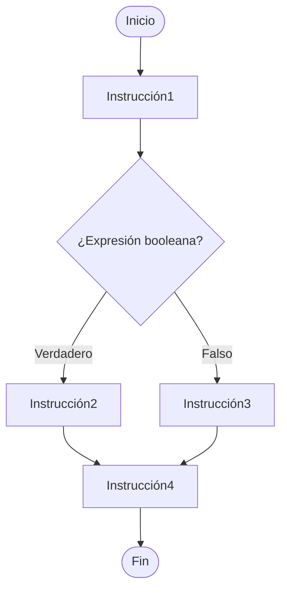

<!--
SPDX-FileCopyrightText: 2024 Daniel Feito Pin

SPDX-License-Identifier: CC-BY-NC-4.0
-->

<web-summary rel="tldr"/>

<procedure>


Visita nuestra nueva página web con contenidos actualizados y mucho más.

Estos apuntes también están en: [Pásame el Código](https://pc.pablopl.dev/prouno/apuntes/b2-control-de-flujo/)

</procedure>

<tip>Copyright © 2024 Daniel Feito Pin</tip>

# Bloque 2 - Control de Flujo

<tldr id="tldr">

Bucles (while / do while / for), Condicionales (if / else / switch) y el Teorema de Böhm y Jacopini (o de la programación estructurada)

</tldr>

## Introducción

### Teorema de Böhm y Jacopini (o de la programación estructurada)

La programación estructurada se basa en programas propios que tienen **un solo punto de entrada** y **un solo punto de
salida**.

- Toda acción del algoritmo es accesible pues existe al menos un camino que va desde el inicio hasta el fin del
  algoritmo pasando a través de dicha acción.
- No tienen bucles infinitos

TEOREMA: todo algoritmo (y por lo tanto, cualquier programa)
se puede construir con sólo **3 componentes estructurales**:

- Secuencia.
- Selección.
- Repetición.

### Clasificación de instrucciones ejecutables en C

- Simples:
    - Asignación.
    - Instrucción vacía.
    - Activación de procedimiento.
    - Instrucción `goto`.
- Estructuradas:
    - Compuestas.
    - Alternativas (Condicionales): `if`-`else`, `switch`.
    - Repetititvas (Bucles): `while`, `do` `while`, `for`.

## Instrucciones simples

### Asignación

Intrucciones del tipo: `variable = valor;`

### Instrucción vacía

Corresponde a un simple `;` sin nada que lo preceda.

### Intrucción goto

La instrucción `goto` permite saltar a otro pundo del programa maracado con una etiqueta.

> Su utilización está **prohibida** dentro de una programación
> estructurada.
>
> Si se quiere alterar el orden de ejecución secuencial se puede realizar con instrucciones condicionales.

## Instrucciones estructuradas

### Instrucción compuesta

Corresponde a varias instrucciones simples y o estructuradas agrupadas entre `{}`.

### Condicionales

#### if - else

Ejecuta un conjunto de intrucciones dependiendo de una condición.

- La condición tiene que ser un valor booleano (verdadero o falso).
    - En C se considera `0` como falso.
    - En C se considera cualquier valor distindo de `0` como verdadero.

- Si la condicón se cumple, se ejecutan las intrucciones de la parte `if`.
- Si no se cumple, se ejecutan las instrucciones de la parte `else`.
- Las instrucciones de ambas partes pueden ser de cualquier tipo.
- Se pueden **anidar** varias sentencias `if`-`else`.
- La cláusula `else` afecta siempre al `if` más próximo.

```c
if (/* Expresión booleana */) /* Instrucción en caso verdadero */;
```

```c
if (/* Expresión booleana */) {
    /* Instrucciones en caso verdadero*/
}
```

```c
if (/* Expresión booleana */) {
    /* Instrucciones en caso verdadero */
} else {
    /* Instrucciones en caso falso */
}
```

En el caso de `if` anidados se suelen alinear al mismo nivel que el anterior:

```c
if (/* Expresión booleana */) {
    /* Instrucciones en caso verdadero */
} else if (/* Otra xpresión booleana */) {
    /* Instrucciones en caso verdadero de la nueva condición */
} else {
    /* Instrucciones en caso falso */
}
```



#### Operador terciario

El operador terciario `?:` se utiliza para ejecutar instrucciones de una forma similar a las cláusulas `if`-`else`:

```c
if (/* Condición */) {
    /* Instrucción 1 */
} else {
    /* Instrucción 2 */
}
```

```c
/* Condición */ ? /* Instrucción 1 */ : /* Instrucción 2 */ ;
```

#### Switch

La cláusula `switch` permite decidir las siguientes instrucciones en función de si una expresión de control coincide con
otras denotadas por etiquetas `case`:

- La expresión de control entre paréntesis debe ser una expresión entera.
    - Los caracteres se tratan como enteros en C y, por lo tanto, se pueden usar en expresiones de control.
    - Sin embargo, los números de punto flotante y las cadenas no se pueden usar en expresiones de control.
- No se permiten etiquetas duplicadas.
- Se pueden poner varias etiquetas en la misma línea.
    - El orden de las etiquetas agrupadas no importa.
- No se requieren llaves `{}` alrededor de las declaraciones de un caso.

```c
switch(/* Expresión de control */) {
    case /* Expresión constante */: /* Instrucciones */
    ...
    case /* Expresión constante */: /* Instrucciones */
    default: /* Instrucciones */
}
```

Tras ejecutar un caso **se ejecutarán todos los siguientes** hasta encontrar una instrucción `break;`, que se utiliza
para salir del `switch`.

Se puede expecificar un caso por defecto `default` que se ejecuta si el valor de la expresión de control no coincide con
ninguna etiqueta.

- Si no hay ninguno, el control del programa pasa a la siguiente instrucción después del `swtich`.

### Bucles

Los **bucles** permiten programar la repetición de una o más instrucciones (el cuerpo del bucle).

En C, cada bucle tiene una expresión de control.

- El número de veces que se repite el cuerpo del bucle está determinado esta sección de control del bucle.
- Si la expresión es verdadera (tiene un valor que no es cero), el bucle continúa ejecutándose.
- Cada vez que se ejecuta el cuerpo del bucle (una iteración), se evalúa la expresión de control.

Debe existir una condición de final para evitar bucles infinitos.

Los distintos tipos de bucles se pueden agrupar en dos categorías:

- Bucles condicionales.
    - `while`.
    - `do` `while`.
- Bucles con contador.
    - `for`.

#### while

Usar una instrucción `while` es la forma más fácil de configurar un bucle.

```c
while (/* Condición */) /* Instrucción */;
```

```c
while (/* Condición */) {
    /* Instrucciones */
}
```

Pasos:

1. Evaluar la condición.
2. Si es falsa: paso 5.
3. Si es verdadera: ejecutar el cuerpo del bucle.
4. Volver al paso 1.
5. Continuar con el resto del programa.

#### do while

La construcción `do` `while` se parece a la construcción `while`, pero garantiza que el cuerpo del bulce se ejecute al
menos una vez.

La condición se evalua por primera vez después de la primera ejecución del cuerpo del bucle.

```c
do {
    /* Instrucciones */
} while (/* Condición */);
```

Pasos:

1. Ejecutar el cuerpo del bucle.
2. Evaluar la condición.
3. Si es verdadera: volver al paso 1.
4. Si es falsa: seguir con el paso 5.
5. Continuar con el resto del programa.

#### for

El bucle `for` es el más adecuada cuando se conoce el número de repeticiones de antemano.

- Utiliza una variable de control que se actualiza en cada iteración.

La forma general de la declaración `for` es:

```c
for(/* expr1 */; /* expr2 */; /* expr3 */) /* statement */;
```

`expr1`, `expr2` y `expr3` son expresiones:

- `expr1`: **Inicialización** de la variable de control.
- `expr2`: **Condición** del bucle.
- `expr3`: **Modificación** de la variable contador tras cada iteración.

La variable de control debe ser de un tipo **ordinal**, así como su valor inicial.

La comprobación de final de bucle se realiza **antes** de ejecutarse las acciones.

> En `C99`, la primera expresión en una instrucción `for` puede reemplazarse por una declaración.
> - Una variable declarada de esta forma solo es accesible desde dentro del cuerpo del bucle.

##### Bucles contadores

La declaración `for` suele ser la mejor opción para los bucles que realizan cuentas o cuenta regresivas.

Una declaración que cuenta hacia arriba o hacia abajo un total de `n` veces tendrá una de las siguientes formas:

- Contando de `0` a `n–1`: `for (i = 0; i <n; i ++) ...`.
- Contando de `1` a `n`: `for (i = 1; i <= n; i ++) ...`.
- Cuenta regresiva de `n–1` a `0`: `for (i = n - 1; i> = 0; i--) ...`.
- Cuenta regresiva de `n` a `1`: `for (i = n; i> 0; i--) ...`.

##### Conversión de bucle for a bucle while

Excepto en algunos casos raros, un bucle `for` siempre se
puede reemplazar por un bucle `while` equivalente:

```c
for(/* expr1 */; /* expr2 */; /* expr3 */) /* statement */;
```

```c
/* expr1 */;
while(/* expr2 */) {
    /* statement */;
    /* expr3 */;
}
```

#### Instrucciones break y continue

La instrucción `break` transfiere el control el final de un bucle.

- Sirve para salir del bucle.

La instrucción `continue` transfiere el control a un punto justo antes del final del cuerpo del bucle.

- Sirve para continuar directamente con la siguiente iteración.

#### Errores comunes en la construcción de bucles

- No inicialización de variable de control: Resultado indeterminado.
- No alteración de la variable de control en el cuerpo del bucle: Bucle infinito.
- No se alcanza la condición de terminación: Bucle infinito.
- Mala sintaxis: Resultados inesperados.

