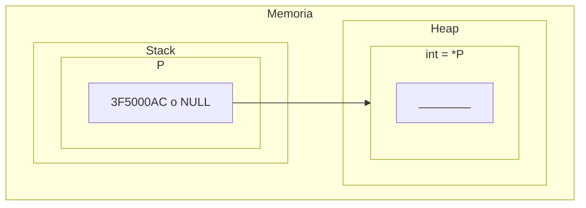
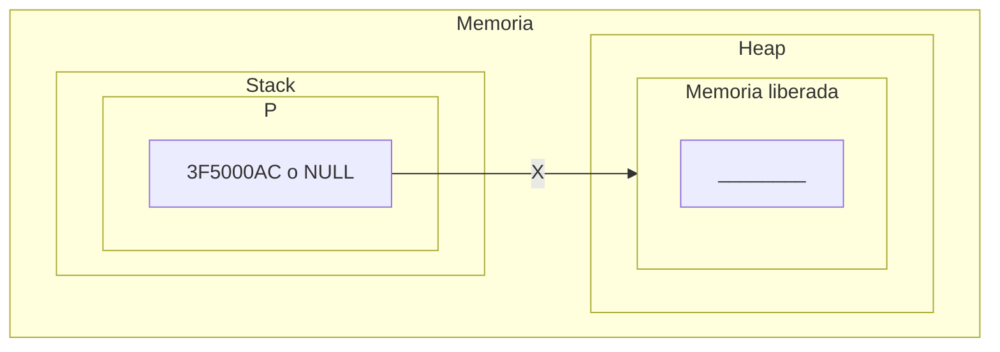
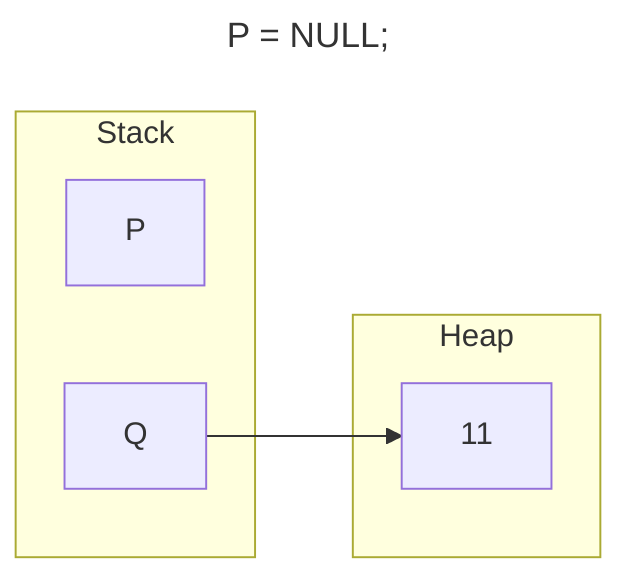
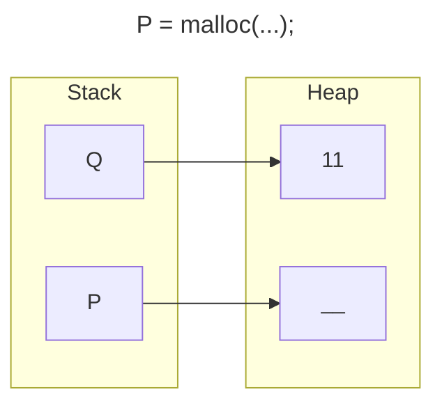
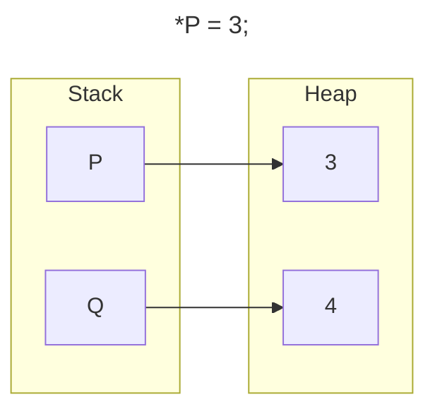
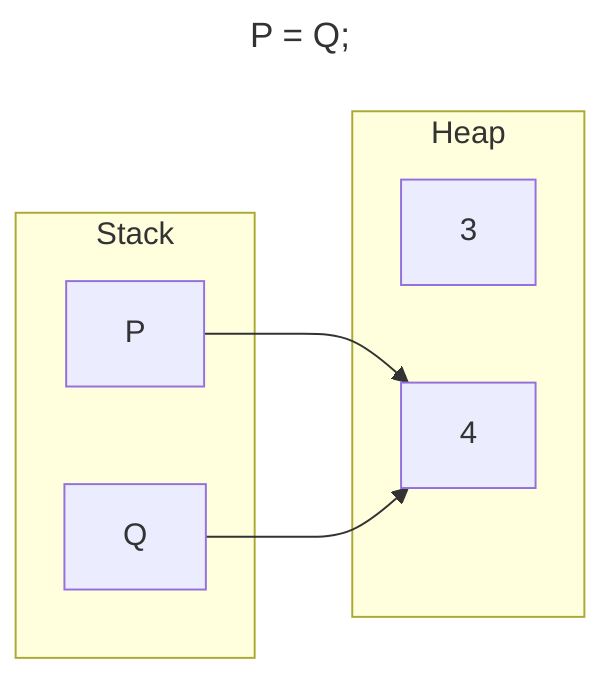
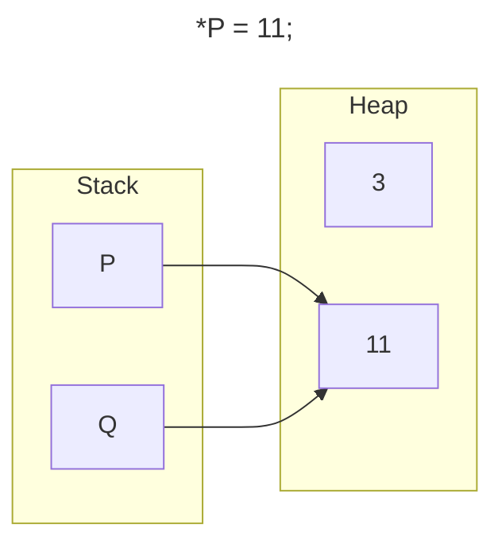
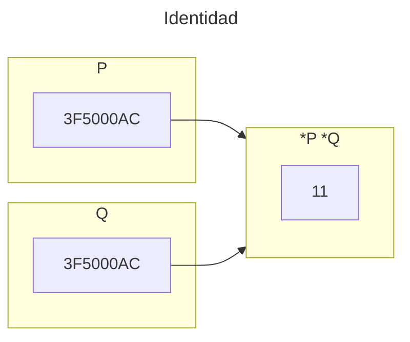
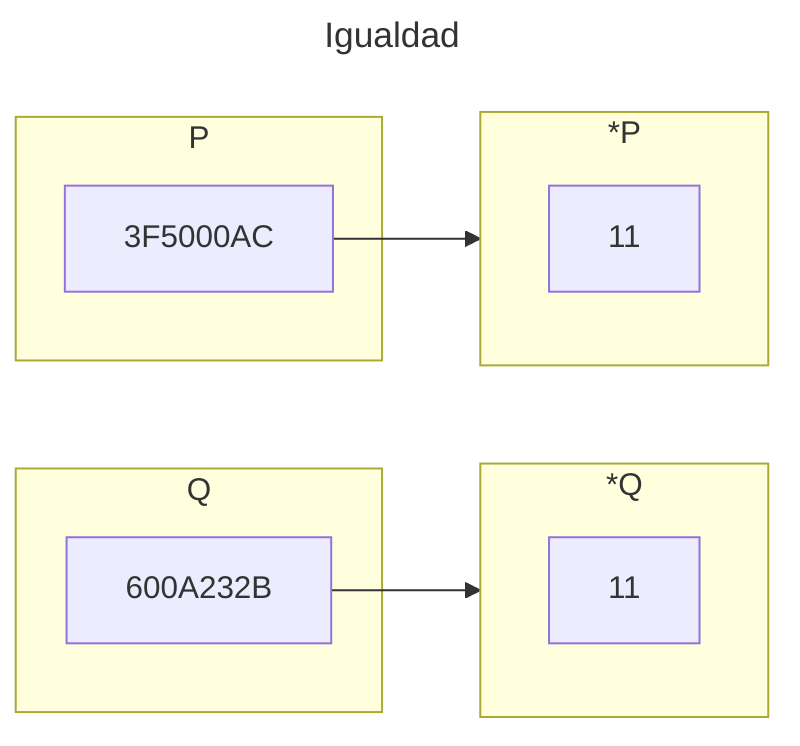

<!--
SPDX-FileCopyrightText: 2024 Pablo Portas López <pablo.portas@udc.es>

SPDX-License-Identifier: CC-BY-NC-4.0
-->

<web-summary rel="tldr"/>

<tip>Copyright © 2024 Pablo Portas López</tip>

# Tema 2 - Gestión dinámica de memoria

<tldr id="tldr">

Punteros en profundidad, las variables dinámicas, direcciones de memoria y la gestión de la memoria (pila (stack) y montículo (heap)).

</tldr>

## Organización de la memoria de un programa

Existen dos lugares en memoria para almacenar elementos: la pila (**stack**) y el montículo (**heap**).

| Nombre           | Función                                                                                                                                                            |
|------------------|--------------------------------------------------------------------------------------------------------------------------------------------------------------------|
| Código           | El código compilado.                                                                                                                                               |
| Datos estáticos  | Datos estáticos compilados.                                                                                                                                        |
| Pila (stack)     | Se utiliza para la llamada de funciones y punteros, ahí se almacenan sus direcciones, parámetros, constantes locales, etc...                                       |
| ...              | Espacio para crecer.                                                                                                                                               |
| Montículo (heap) | Parte de la memoria que no está ligada a lo guardado en la pila, se utiliza para las variables dinámicas, la memoria se reserva cuando se solicita (```malloc```). |

## Definición de variables de tipo puntero

<deflist>
<def title="Punteros en C">

- Un puntero es un **tipo básico** en C (como ```int```, ```bool```, ```float```, ```etc```.) y como tal **ocupa en
  memoria una cantidad determinada** (generalmente 4 bytes).
- Una variable de tipo puntero **contiene una dirección de memoria** en la cual se almacena **una variable de otro tipo
  **.
- Las variables de tipo puntero en C se declara para que apunte a un tipo particular de
  datos (```int```, ```float```, ```etc```.) y no puede apuntar a ningún otro.

</def>
<def title="Sintaxis">
<code-block lang="C">
// Estructura
typedef tipoApuntado* tipoPuntero
// Otro ejemplo
typedef int* tPEntero
// tPEntero es un puntero a int
tPEntero P
// Has declarado un puntero P 
// que no apunta a nada todavía
</code-block>
</def>
</deflist>

## Reserva y destrucción dinámica de memoria

### Inicialización de punteros

```C
typedef int* tPEntero;
tPEntero P1;
int* P2;
```

- ```tPEntero``` las variables declaradas con este nuevo tipo contendrán direcciones de memoria de **variables enteras
  **.
- ```P1``` se **reserva memoria** en la **pila** para guardar una **dirección de memoria** (4 bytes) que apuntara a un
  entero del **montículo**.
- No es necesario definir un tipo para declarar un entero (como se ve en ```int* P2```), pero se recomienda hacerlo de
  esta manera para **aumentar la abstracción**.
- La memoria es reservada, pero **no se elimina los contenidos que ya hubiera en esa zona**. Inicialmente, ```P1```
  o ```P2``` contendrá un valor _basura_.

  Utilizar punteros con contenido _basura_ puede tener **efectos fatales**. Por lo tanto, es mejor inicializarlos a
  nulo ```P = NULL;```

<warning>En el lenguaje C este valor nulo se representa con la constante <b>NULL</b>, esta constante es <b>la dirección de memoria nula</b>.</warning>

### La variable dinámica

#### Creación de una variable dinámica

Para crear la variable dinámica apuntada por un puntero se utiliza el operador ```malloc``` definido en el archivo de
cabecera ```stdlib```.

```C
#include <stdlib>
P = malloc(sizeof(int));
// Memoria suficiente para un entero
```



<warning>
En caso de no existir memoria suficiente disponible al puntero <code>P</code> se le asigna valor <b>NULL</b>
</warning>

#### Destrucción de una variable dinámica

Para liberar la memoria de la variable dinámica se utiliza ```free``` definido en el archivo de cabecera ```stdlib```.

Se marcará la variable a la que apunta el puntero como liberada, aunque **la información no es destruida**, ya no es
accesible.

```C
#include <stdlib>
free(P);
```



#### Acceso a una variable dinámica

```C
// Declaración
int i;
int* p;

// Creación
/* - - - */
p = malloc(sizeof(int))

// Escritura
i = 5;
*p = 5;

// Lectura
j = i;
j = *p; 
```

## Asignación y comparación de punteros

#### Asignación de valores a punteros

```C
// Tenemos dos variables dinámicas P y Q
P = NULL; // Puntero a valor nulo
P = malloc(sizeof(int)); // Se reserva la memoria (se le asigna dirección de memoria)
*P = 3; // Se le asigna un entero
// Q tenía un valor previo *Q = 4;
P = Q; // Asignamos al puntero el valor de otro puntero
*P = 11;
printf("%d",*Q); // Resultado: 11
```

Es decir ahora ```P``` **no** tiene la dirección de memoria que se le asignó al liberar la memoria, **tiene la
de ```Q```**. Visualmente:











<warning>

En este código hay un error, al cambiar la dirección de P, debíamos hacer ```free(P)```. Al no hacerlo el ```3``` queda
**ocupando memoria** hasta el final de la ejecución.

</warning>

### Comparación de punteros

```C
// Identidad
printf(P == Q); // Solo si tienen la misma dirección de memoria
// Igualdad
printf(*P == *Q); // Solo si su contenido es el mismo
```





## Resumen sobre el uso de punteros y variables dinámicas

<deflist>
<def title="Definición y declaración">
  <code-block lang="C">
  typedef int* pEntero;
  pEntero p;
  </code-block>
</def>
<def title="Inicialización / Creación">
  <code-block lang="C">
  p = NULL;
  // O para las Variables dinámica
  p = malloc(sizeof(int));
  </code-block>
  <p>Se recomienda inicializar siempre los punteros, para no dejar valores <i>basura</i>.</p>
</def>
<def title="Destrucción de una variable">
  <code-block lang="C">
  free(p); // Liberar memoria (borrar valor)
  p = NULL;
  </code-block>
  <p>Siempre se debe hacer para crear un programa más eficiente en memoria.</p>
</def>
<def title="Contenido de la variable dinámica">
  <code-block lang="C">
  *p = valor; // Cambiar el valor
  variable = *p; // Copiar el valor
  </code-block>
</def>
<def title="Asignación de valores a punteros">
  <code-block lang="C">
  p = NULL; // Dirección nula
  p = malloc(sizeof()); // Dirección de memoria recién liberada
  p = q; // Dirección de otro puntero
  </code-block>
</def>
<def title="Comparación de punteros">
  <code-block lang="C">
  p == q; p != q; // Comparación entre punteros
  p == NULL; p != NULL; // Comparación con valor nulo
  </code-block>
</def>
</deflist>

## Paso de punteros como parámetros

En C por defecto las variables se pasan **por valor**, no existe el paso por referencia, para emularlo se emplean
**direcciones de memoria** (**punteros**). He aquí algunos **ejemplos** de los diferentes pasos de parámetros.

### Paso de punteros por valor

```C
// Esta función devuelve 0 o 1 dependiendo de si el puntero contiene NULL
int IsNull (tPInteger p) {
  if (p == NULL)
    return 1;
  else
    return 0;
}
// Otra opción más correcta sería
int IsNull (tPInteger p) {
  return (p == NULL);
}
```

### Paso de punteros por referencia

```C
// Función Swap que intercambia las direcciones de memoria de dos punteros
void Swap (tPInteger* p, tPInteger* q) {
  tPInteger t;
  
  if (!IsNull(*p) && !IsNull(*q)) {
    t = *p;
    *p = *q;
    *q = t;
  }
}
```

## Paso de variables dinámicas como parámetros

### Paso de variables por valor

```C
// Función printscr que imprime el contenido de una variable dinámica entera
int *p;

int printscr1 (int m) {
  printf("%d \n",m);
}

int main () {
  ...
  printsrc1(*p);
  ...
}

// Otra opción sería

int *p;

int printscr2 (int* m) {
  printf(” %d \n”,*m);
}
void main () {
  ...
  printscr2(p);
  ...
}
```

### Paso de variables por referencia

```C
// Función readInteger para rellenar una variable dinámica
int *p;
int a;

void main () {
  ...
  CreateVariable(&p);
  readInteger(p);
  readInteger(&a);
  ...
}

void readInteger (int* m) {
  printf(”Give me an integer value: \n”);
  scanf(” %d”, m);
}
```

## Errores más comunes en el manejo de punteros

### Avisos de compilación más frecuentes (Warnings)

- Las variables puntero solo pueden apuntar a datos de **un tipo particular**. Por lo tanto, para que los punteros
  puedan compararse o asignarse entre sı́ **tienen que ser del mismo tipo**.

- Confundir el puntero (p) con la variable a la que apunta (*p).

### Errores de ejecución más frecuentes (Errors)

- Las variables referenciadas por puntero (variables dinámicas) solo existen cuado se inicia el apuntador mediante la
  asignación a **una variable que ya existe** o mediante ```malloc()```. Un error muy frecuente es intentar acceder a la
  variable cuando no existe.
  ```C
  // Incorrecto
  typedef int* tPos;
  tPos p;
  ...
  *p = ...
  // Correcto
  typedef int* tPos;
  tPos p, q;
  ...
  p = malloc(sizeof(int)); 
  *p = ...
  // O bien
  q = malloc(sizeof(int)); 
  p = q;
  *p = ...
  ```
  <warning>

  Los punteros acceden directamente a la memoria del ordenador, por tanto, pueden intentar acceder a posiciones no
  reservadas si no son inicializados correctamente. Una **solución sencilla** es siempre iniciar vectores **apuntando
  a ```NULL```**.

  </warning>

- Cuando tenemos varios punteros que apuntan a la misma variable ```*q = 3; p = q; j = q; *j = 5;``` modificar
  cualquiera de ellos ```q, p o j``` **sobrescribirá el contenido de todas**.

  Si cualquiera de ellos libera su memoria ```free(p)```, todos quedarán des referenciados.

- La memoria de un ordenador **es grande pero no ilimitada**. Un programa **eficiente** es aquel que usa el mínimo de
  memoria necesaria. Por eso debemos emplear ```free()``` en aquellos punteros que vayamos a modificar. Consejos:
    1. Dejar variables a las que no apunta ningún puntero, sin haber hecho un ```free()```.
    2. Hacer ```free()``` y no preocuparnos de que apunte a ```NULL```.
    3. Hacer un ```free()``` y tratar de acceder posteriormente al puntero.
