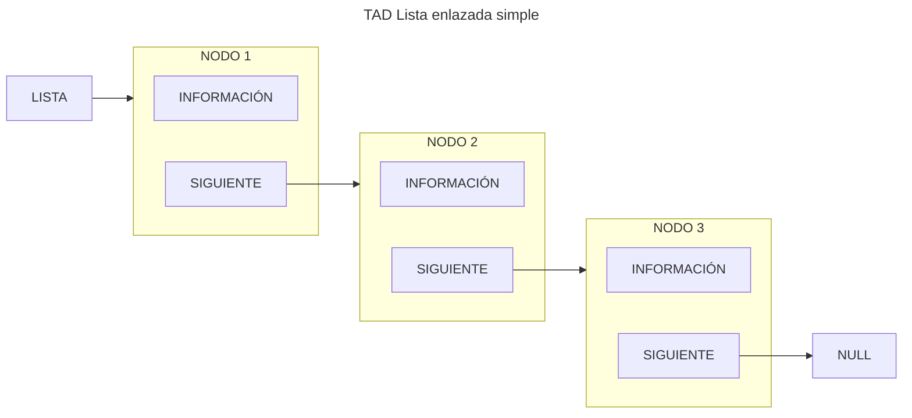
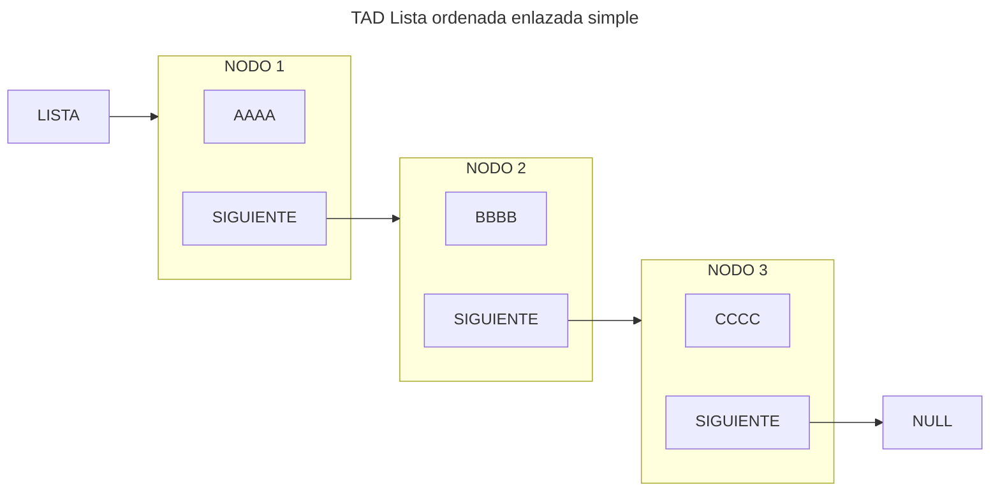

<!--
SPDX-FileCopyrightText: 2024 Pablo Portas López <pablo.portas@udc.es>

SPDX-License-Identifier: CC-BY-NC-4.0
-->

<web-summary rel="tldr"/>

<tip>Copyright © 2024 Pablo Portas López</tip>

# Tema 3 - Listas

<tldr id="tldr">

El TAD Lista, especificación informal, implementación y descripción gráfica. Operaciones explicadas de forma gráfica e
implementadas. Otros tipos de TAD como Lista Ordenada y Multilistas también explicados.

</tldr>

## TAD Lista

<note>Esto es una especificación informal del TAD</note>

Una lista es por definición un conjunto de cero o más elementos.

Los elementos están ordenados de forma lineal, no por su contenido, sino simplemente por la posición que ocupan
relativos unos a otros.



Por lo tanto, la lista está formada por ``nodos`` idénticos. Cada nodo está formado por dos elementos, la información
del propio nodo y un puntero que apunta al siguiente. Además, el inicio de la lista está delimitado por un
puntero ``Lista``, y finaliza con el último nodo que apunta a ``NULL``.

### Operaciones

Siguiendo los pasos para la especificación de un TAD, definimos las operaciones del mismo clasificándolas en:
constructoras, generadoras, modificadoras, observadoras y destructoras.

<note>

Para más información: [](Tema-1-Tipos-Abstractos-de-Datos-TAD.md#especificaci-n-de-un-tad)

</note>

#### Generadoras

<list>
<li>
<code-block lang="tex"> createEmptyList \rightarrow List </code-block><br/>
<p>
Objetivo: Crear una lista vacía y la inicializa<br/>
Salida: Una lista vacía<br/>
Poscondición: La lista sin datos<br/>
</p>
<code-block lang="mermaid">
flowchart LR
    LISTA --&gt; NULL
</code-block>
<code-block lang="c" src="./Ejemplos/Tema_3/createEmptyList.c" collapsible="true" collapsed-title="Mostrar implementación"/>
</li>
<li>
<code-block lang="tex"> insertItem (Item, Position, List) \rightarrow List, Boolean </code-block><br/>
<p>
Objetivo: Si la posición es nula, añade un elemento al final de la lista. En caso contrario, el elemento quedará
insertado justo antes del que actualmente ocupa la posición indicada.<br/>
Entrada:<br/>
- Item: Contenido del elemento a insertar<br/>
- Position: Posición de referencia para la inserción<br/>
- List: Lista donde vamos a insertar<br/>
Salida: List: Lista con el elemento Item insertado y verdadero si se ha podido insertar, falso en caso contrario<br/>
Precondición: Position es una posición válida de la lista o es una posición nula<br/>
Postcondición: Las posiciones de los elementos de la lista posteriores a la del elemento insertado pueden haber
variado<br/>
</p>
<code-block lang="mermaid">
flowchart LR
    LISTA
    subgraph NODO1[NODO 1]
        CONTENIDO1[INFORMACIÓN]
        SIGUIENTE1[SIGUIENTE]
    end
    subgraph NODO3[NODO 2]
        CONTENIDO3[INFORMACIÓN]
        SIGUIENTE3[SIGUIENTE]
    end
    LISTA --&gt; NODO1
    SIGUIENTE1 --&gt; NODO3
    SIGUIENTE3 --&gt; NULL
</code-block>
<code-block lang="mermaid">
flowchart LR
    LISTA
    subgraph NODO1[NODO 1]
        CONTENIDO1[INFORMACIÓN]
        SIGUIENTE1[SIGUIENTE]
    end
    subgraph NODO2[NUEVO NODO]
        CONTENIDO2[INFORMACIÓN]
        SIGUIENTE2[SIGUIENTE]
    end
    subgraph NODO3[NODO 2]
        CONTENIDO3[INFORMACIÓN]
        SIGUIENTE3[SIGUIENTE]
    end
    LISTA --&gt; NODO1
    SIGUIENTE1 -.-&gt; NODO2
    SIGUIENTE2 -.-&gt; NODO3
    SIGUIENTE3 --&gt; NULL
</code-block>
<code-block lang="c" src="./Ejemplos/Tema_3/insertItem.c" collapsible="true" collapsed-title="Mostrar implementación"/>
</li>
</list>

### Modificadores

<list>
<li>
<code-block lang="tex"> copyList(List_1) \rightarrow List_2, Boolean </code-block><br/>
<p>
Objetivo: Copia una lista en otra<br/>
Entrada: List_1: Lista que vamos a copiar<br/>
Salida: List_2: Copia de la lista original y verdadero si se ha podido copiar, falso en caso contrario<br/>
Precondición: La lista origen está inicializada<br/>
</p>
<code-block lang="mermaid">
flowchart LR
    LISTA1[LISTA 1] --&gt; NODO1 --&gt; NODO2 --&gt; NULL
    LISTA2[LISTA 2]
</code-block>
<code-block lang="mermaid">
flowchart LR
    LISTA1[LISTA 1] --&gt; NODO1[NODO 1] --&gt; NODO2[NODO 2] --&gt; NULL
    LISTA2[LISTA 2] --&gt; NODO21[NUEVO NODO]
    LISTA2 -. X .-&gt; NODO1[NODO 1]
</code-block>
<code-block lang="mermaid">
flowchart LR
    LISTA1[LISTA 1] --&gt; NODO1[NODO 1] --&gt; NODO2[NODO 2] --&gt; NULL
    LISTA2[LISTA 2] --&gt; NODO21[NODO 1]
    NODO1 == copiar ==&gt; NODO21[NODO 1]
</code-block>
<code-block lang="mermaid">
flowchart LR
    LISTA1[LISTA 1] --&gt; NODO1[NODO 1] --&gt; NODO2[NODO 2] --&gt; NULL
    LISTA2[LISTA 2] --&gt; NODO21[NODO 1] --&gt; NODO22[NUEVO NODO]
    NODO2 == copiar ==&gt; NODO22[NUEVO NODO]
</code-block>
<code-block lang="mermaid">
flowchart LR
    LISTA1[LISTA 1] --&gt; NODO1[NODO 1] --&gt; NODO2[NODO 2] --&gt; NULL
    LISTA2[LISTA 2] --&gt; NODO21[NODO 1] --&gt; NODO22[NODO 2] --&gt; NULL
</code-block>
<code-block lang="c" src="./Ejemplos/Tema_3/copyList.c" collapsible="true" collapsed-title="Mostrar implementación"/>
</li>
<li>
<code-block lang="tex"> updateItem (Item, Position, List) \rightarrow List </code-block><br/>
<p>
Objetivo: Modifica el contenido de un elemento de la lista<br/>
Entrada:<br/>
- Item: Nuevo contenido a asignar al elemento en Position<br/>
- Position: Posición del elemento que queremos modificar<br/>
- List: Lista a modificar<br/>
Salida: List: Lista con el contenido del elemento modificado<br/>
Precondición: Position es una posición válida de la lista<br/>
</p>
<code-block lang="mermaid">
flowchart LR
    LISTA
    subgraph NODO1[NODO 1]
        CONTENIDO1[INFORMACIÓN]
        SIGUIENTE1[SIGUIENTE]
    end
    subgraph NODO2[NODO A MODIFICAR]
        CONTENIDO2[INFORMACIÓN ANTIGUA]
        SIGUIENTE2[SIGUIENTE]
    end
    subgraph NODO3[NODO 2]
        CONTENIDO3[INFORMACIÓN]
        SIGUIENTE3[SIGUIENTE]
    end
    subgraph MOD[_]
        INFO[NUEVA INFORMACIÓN]
        POS[POSICIÓN A MODIFICAR]
    end
    LISTA --&gt; NODO1
    SIGUIENTE1 --&gt; NODO2
    SIGUIENTE2 --&gt; NODO3
    SIGUIENTE3 --&gt; NULL
    INFO -.-&gt; CONTENIDO3
    POS --&gt; NODO3
</code-block>
<code-block lang="c" src="./Ejemplos/Tema_3/updateItem.c" collapsible="true" collapsed-title="Mostrar implementación"/>
</li>
</list>

### Destructoras

<list>
<li>
<code-block lang="tex"> deleteAtPosition(Position, List) \rightarrow List </code-block><br/>
<p>
Objetivo: Elimina de la lista un elemento con cierta posición<br/>
Entrada:
Position: Posición del elemento a eliminar
List: Lista a modificar
Salida: List: Lista sin el elemento correspondiente a Position<br/>
Precondición: Position es una posición válida de la lista<br/>
Postcondición: Las posiciones de los elementos de la lista posteriores a la de la posición eliminada pueden haber
variado<br/>
</p>
<code-block lang="mermaid">
flowchart TB
    LISTA
    subgraph NODO1[NODO 1]
        CONTENIDO1[INFORMACIÓN]
        SIGUIENTE1[SIGUIENTE]
    end
    subgraph NODO2[NODO A ELIMINAR]
        CONTENIDO2[INFORMACIÓN]
        SIGUIENTE2[SIGUIENTE]
    end
    subgraph NODO3[NODO 2]
        CONTENIDO3[INFORMACIÓN]
        SIGUIENTE3[SIGUIENTE]
    end
    LISTA --&gt; NODO1
    SIGUIENTE1 -.-&gt; NODO2
    SIGUIENTE1 --&gt; NODO3
    SIGUIENTE2 -.-&gt; NODO3
    SIGUIENTE3 --&gt; NULL
</code-block>
<code-block lang="mermaid">
flowchart TB
    LISTA
    subgraph NODO1[NODO 1]
        CONTENIDO1[INFORMACIÓN]
        SIGUIENTE1[SIGUIENTE]
    end
    subgraph NODO3[NODO 2]
        CONTENIDO3[INFORMACIÓN]
        SIGUIENTE3[SIGUIENTE]
    end
    LISTA --&gt; NODO1
    SIGUIENTE1 --&gt; NODO3
    SIGUIENTE3 --&gt; NULL
</code-block>
<code-block lang="c" src="./Ejemplos/Tema_3/deleteAtPosition.c" collapsible="true" collapsed-title="Mostrar implementación"/>
</li>
<li>
<code-block lang="tex"> deleteList (List) \rightarrow List </code-block><br/>
<p>
Objetivo: Elimina todos los elementos de la lista<br/>
Entrada: List: Lista a borrar<br/>
Salida: Lista vacía<br/>
</p>
<code-block lang="mermaid">
flowchart TB
    LISTA
    subgraph NODO1[NODO 1]
        CONTENIDO1[INFORMACIÓN]
        SIGUIENTE1[SIGUIENTE]
    end
    subgraph NODO2[NODO 2]
        CONTENIDO2[INFORMACIÓN]
        SIGUIENTE2[SIGUIENTE]
    end
    subgraph NODO3[NODO 3]
        CONTENIDO3[INFORMACIÓN]
        SIGUIENTE3[SIGUIENTE]
    end
    LISTA --&gt; NODO1
    SIGUIENTE1 --&gt; NODO2
    SIGUIENTE2 --&gt; NODO3
    SIGUIENTE3 -.-&gt; NULL
    DELETE["FREE ()"] ==&gt; NODO3
</code-block>
<code-block lang="mermaid">
flowchart TB
    LISTA
    subgraph NODO1[NODO 1]
        CONTENIDO1[INFORMACIÓN]
        SIGUIENTE1[SIGUIENTE]
    end
    subgraph NODO2[NODO 2]
        CONTENIDO2[INFORMACIÓN]
        SIGUIENTE2[SIGUIENTE]
    end
    LISTA --&gt; NODO1
    SIGUIENTE1 --&gt; NODO2
    SIGUIENTE2 -.-&gt; NODO3[ANTIGUA DIRECCIÓN DE NODO 3]
    NULL
    DELETE["FREE ()"] ==&gt; NODO2
</code-block>
<code-block lang="mermaid">
flowchart TB
    LISTA
    subgraph NODO1[NODO 1]
        CONTENIDO1[INFORMACIÓN]
        SIGUIENTE1[SIGUIENTE]
    end
    LISTA --&gt; NODO1
    SIGUIENTE1 -.-&gt; NODO2[ANTIGUA DIRECCIÓN DE NODO 2]
    NULL
    DELETE["FREE ()"] ==&gt; NODO1
</code-block>
<code-block lang="mermaid">
flowchart LR
    LISTA --&gt; NULL
</code-block>
<code-block lang="c" src="./Ejemplos/Tema_3/deleteList.c" collapsible="true" collapsed-title="Mostrar implementación"/>
</li>
</list>

#### Observadoras

<list>
<li>
<code-block lang="tex"> findItem (Item, List) \rightarrow Position </code-block><br/>
<p>
Objetivo: Busca el primer elemento con cierto contenido en la lista<br/>
Entrada:<br/>
- Item: Contenido del elemento buscado<br/>
- List: Lista donde realizar la búsqueda<br/>
Salida: Position: Posición del elemento encontrado o nulo si no se encuentra<br/>
</p>
<code-block lang="mermaid">
flowchart TB
    LISTA
    subgraph NODO1[NODO 1]
        CONTENIDO1[USUARIO 1]
        SIGUIENTE1[SIGUIENTE]
    end
    subgraph NODO2[NODO 2]
        CONTENIDO2[USUARIO 2]
        SIGUIENTE2[SIGUIENTE]
    end
    subgraph NODO3[NODO 3]
        CONTENIDO3[USUARIO 3]
        SIGUIENTE3[SIGUIENTE]
    end
    LISTA --&gt; NODO1
    SIGUIENTE1 --&gt; NODO2
    SIGUIENTE2 --&gt; NODO3
    SIGUIENTE3 --&gt; NULL
    FIND["¿ERES EL USUARIO3?"] -- NO --&gt; NODO1
</code-block>
<code-block lang="mermaid">
flowchart TB
    LISTA
    subgraph NODO1[NODO 1]
        CONTENIDO1[USUARIO 1]
        SIGUIENTE1[SIGUIENTE]
    end
    subgraph NODO2[NODO 2]
        CONTENIDO2[USUARIO 2]
        SIGUIENTE2[SIGUIENTE]
    end
    subgraph NODO3[NODO 3]
        CONTENIDO3[USUARIO 3]
        SIGUIENTE3[SIGUIENTE]
    end
    LISTA --&gt; NODO1
    SIGUIENTE1 --&gt; NODO2
    SIGUIENTE2 --&gt; NODO3
    SIGUIENTE3 --&gt; NULL
    FIND["¿ERES EL USUARIO3?"] -- NO --&gt; NODO2
</code-block>
<code-block lang="mermaid">
flowchart TB
    LISTA
    subgraph NODO1[NODO 1]
        CONTENIDO1[USUARIO 1]
        SIGUIENTE1[SIGUIENTE]
    end
    subgraph NODO2[NODO 2]
        CONTENIDO2[USUARIO 2]
        SIGUIENTE2[SIGUIENTE]
    end
    subgraph NODO3[NODO 3]
        CONTENIDO3[USUARIO 3]
        SIGUIENTE3[SIGUIENTE]
    end
    LISTA --&gt; NODO1
    SIGUIENTE1 --&gt; NODO2
    SIGUIENTE2 --&gt; NODO3
    SIGUIENTE3 --&gt; NULL
    FIND["¿ERES EL USUARIO3?"] -- SI --&gt; NODO3
</code-block>
<code-block lang="c" src="./Ejemplos/Tema_3/findItem.c" collapsible="true" collapsed-title="Mostrar implementación"/>
</li>
<li>
<code-block lang="tex"> isEmptyList (List) \rightarrow Boolean </code-block><br/>
<p>
Objetivo: Determina si la lista está vacía<br/>
Entrada: List: Lista a comprobar<br/>
Salida: Verdadero si la lista está vacía, falso en caso contrario<br/>
</p>
<code-block lang="c" src="./Ejemplos/Tema_3/isEmptyList.c" collapsible="true" collapsed-title="Mostrar implementación"/>
</li>
<li>
<code-block lang="tex"> getItem (Position, List) \rightarrow Item </code-block><br/>
<p>
Objetivo: Recupera el contenido de un elemento de la lista<br/>
Entrada: Position: Posición del elemento buscado<br/>
List: Lista donde realizar la búsqueda<br/>
Salida: Item: Contenido del elemento que está en Position<br/>
Precondición: Position es una posición válida en la lista<br/>
</p>
<code-block lang="c" src="./Ejemplos/Tema_3/getItem.c" collapsible="true" collapsed-title="Mostrar implementación"/>
</li>
<li>
<code-block lang="tex"> first (List) \rightarrow Position </code-block><br/>
<p>
Objetivo: Devuelve la posición del primer elemento de la lista<br/>
Entrada: List: Lista a manipular<br/>
Salida: Position: Posición del primer elemento<br/>
Precondición: La lista no está vacía<br/>
</p>
<code-block lang="c" src="./Ejemplos/Tema_3/first.c" collapsible="true" collapsed-title="Mostrar implementación"/>
</li>
<li>
<code-block lang="tex"> last (List) \rightarrow Position </code-block><br/>
<p>
Objetivo: Devuelve la posición del último elemento de la lista<br/>
Entrada: List: Lista a manipular<br/>
Salida: Position: Posición del último elemento<br/>
Precondición: La lista no está vacía<br/>
</p>
<code-block lang="c" src="./Ejemplos/Tema_3/last.c" collapsible="true" collapsed-title="Mostrar implementación"/>
</li>
<li>
<code-block lang="tex"> previous (Position, List) \rightarrow Position </code-block><br/>
<p>
Objetivo: Devuelve la posición del elemento anterior al actual<br/>
Entrada: Position: Posición del elemento actual<br/>
List: Lista a manipular<br/>
Salida: Posición del elemento anterior o nulo si es el primero<br/>
Precondición: Position es una posición válida de la lista<br/>
</p>
<code-block lang="c" src="./Ejemplos/Tema_3/previous.c" collapsible="true" collapsed-title="Mostrar implementación"/>
</li>
<li>
<code-block lang="tex"> next (Position, List) \rightarrow Position </code-block><br/>
<p>
Objetivo: Devuelve la posición del elemento siguiente al actual<br/>
Entrada:<br/>
- Position: Posición del elemento actual<br/>
- List: Lista a manipular<br/>
Salida: Position: Posición del elemento siguiente o nulo si es el último<br/>
Precondición: Position es una posición válida de la lista<br/>
</p>
<code-block lang="c" src="./Ejemplos/Tema_3/next.c" collapsible="true" collapsed-title="Mostrar implementación"/>
</li>
</list>

## TAD Lista ordenada

<note>Esto es una especificación informal del TAD</note>

Los elementos están ordenados de forma lineal por su contenido.

En caso de ordenación alfabética:



### Operación a cambiar

Las operaciones del TAD lista ordenada es idéntico al TAD anterior, la única a modificar es la operación de inserción:

<list>
<li>
<code-block lang="tex"> insertItem (Item, Position, List) \rightarrow List, Boolean </code-block><br/>
<p>
Objetivo: Inserta un elemento en la lista según el criterio de ordenación sobre el campo Item<br/>
Entrada:<br/>
- Item: Contenido del elemento a insertar<br/>
- List: Lista donde vamos a insertar<br/>
Salida: List: Lista con el elemento Item insertado en la posición correspondiente según su contenido y verdadero si se
ha podido insertar, falso en caso contrario<br/>
Precondición: La lista está inicializada<br/>
Postcondición: Las posiciones de los elementos de la lista posteriores a la del elemento insertado pueden haber
variado<br/>
</p>
<code-block lang="mermaid">
flowchart TB
    LISTA
    subgraph NODO1[NODO 1]
        CONTENIDO1[AAA]
        SIGUIENTE1[SIGUIENTE]
    end
    subgraph NODO2[NUEVO 2]
        CONTENIDO2[BBB]
        SIGUIENTE2[SIGUIENTE]
    end
    subgraph NODO3[NODO 3]
        CONTENIDO3[DDD]
        SIGUIENTE3[SIGUIENTE]
    end
    subgraph NODO4[NUEVO NODO]
        CONTENIDO4[CCC]
        SIGUIENTE4[SIGUIENTE]
    end
    LISTA --&gt; NODO1
    SIGUIENTE1 --&gt; NODO2
    SIGUIENTE2 --&gt; NODO3
    SIGUIENTE3 --&gt; NULL
</code-block>
<code-block lang="mermaid">
flowchart TB
    LISTA
    subgraph NODO1[NODO 1]
        CONTENIDO1[AAA]
        SIGUIENTE1[SIGUIENTE]
    end
    subgraph NODO2[NUEVO 2]
        CONTENIDO2[BBB]
        SIGUIENTE2[SIGUIENTE]
    end
    subgraph NODO3[NODO 3]
        CONTENIDO3[DDD]
        SIGUIENTE3[SIGUIENTE]
    end
    subgraph NODO4[NUEVO NODO]
        CONTENIDO4[CCC]
        SIGUIENTE4[SIGUIENTE]
    end
    LISTA --&gt; NODO1
    SIGUIENTE1 --&gt; NODO2
    SIGUIENTE2 -.-&gt; NODO4
    SIGUIENTE4 -.-&gt; NODO3
    SIGUIENTE3 --&gt; NULL
</code-block>
<code-block lang="c" src="./Ejemplos/Tema_3/insertItem_Ordenada.c" collapsible="true" collapsed-title="Mostrar implementación"/>
</li>
</list>

<note>

Al ser una lista ordenada, puede aprovecharse para volver más eficiente el algoritmo de búsqueda
de ``findItem(Item,List)``.

</note>

## Comparación entre TADs

<table>
<tr><td> </td><td>Estática</td><td>Simple Enlace</td><td>Doble Enlace</td></tr>
<tr><td>Necesidad de memoria</td><td>Mucha</td><td>Menos en promedio</td><td>Menos en promedio (+ que simple enlace)</td></tr>
<tr><td>Memoria contigua</td><td>✅</td><td>❌</td><td>❌</td></tr>
<tr><td>Acceso directo</td><td>✅</td><td>❌</td><td>❌</td></tr>
<tr><td>Ampliable</td><td>❌</td><td>✅</td><td>✅</td></tr>
<tr><td>Operaciones más costosas</td><td>insertItem, deleteAtPosition (excepto al final)</td><td>insertItem (final), deleteAtPosition (final), previous, last, deleteList, copyList</td><td>insertItem (final), last, deleteList, copyList</td></tr>
<tr><td>Seguridad</td><td>⚔️😡🛡️</td><td>😴🛡️</td><td>😴🛡️</td></tr>
</table>

## Archivo de Cabecera TAD

```C
#include <stdbool.h>

#define LNULL ...; //Constante que representa posiciones nulas

// Se define en funcion del problema
typedef ... tItemL;
typedef ... tPosL;
typedef ... tList;

// Generadoras
void createEmptyList(tList* L);
bool insertItem(tItemL d, tPosL p, tList* L);

// Modificadoras
bool copyList(tList L, tList* M);
void updateItem(tItemL d , tPosL p, tList* L);

// Destructoras
void deleteAtPosition(tPosL p, tList* L);
void deleteList(tList* L);

// Observadoras
tPosL findItem(tItemL d, tList L);
bool isEmptyList(tList L);
tItemL getItem(tPosL p, tList L);
tPosL first(tList L) ;
tPosL last(tList L);
tPosL previous(tPosL p, tList L);
tPosL next(tPosL p, tList L);
```

## Multilistas

En problemas de programación reales hacen falta soluciones complejas. Es habitual combinar múltiples TAD simples para
construir un TAD complejo.

En este caso el TAD multilistas es un ejemplo de combinación de TADs, en este caso, listas.

### TAD Multilistas

La multilista consiste, en crear sublistas enlazadas a los nodos de una lista principal.

A una lista de usuarios podríamos enlazar, por ejemplo, una playlist para cada uno.


### TAD Multiordenadas

Esta lista multiordenada consta de dos punteros, uno apunta al primer nodo ordenada por nombre, y el otro al primer DNI.

Los están enlazados entre ellos doblemente. Marcando el nodo anterior y siguiente, en dos categorías: **Nombre** y **DNI
**.

