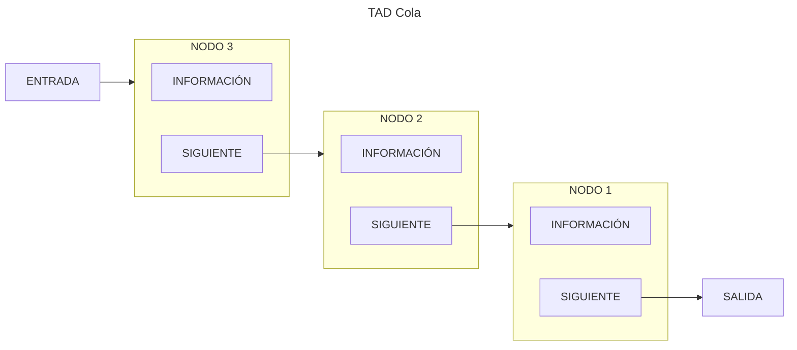

<!--
SPDX-FileCopyrightText: 2024 Pablo Portas López <pablo.portas@udc.es>

SPDX-License-Identifier: CC-BY-NC-4.0
-->

<web-summary rel="tldr"/>

<tip>Copyright © 2024 Pablo Portas López</tip>

# Tema 4 - Colas

<tldr id="tldr">

El TAD Cola, especificación informal, implementación y descripción gráfica. Operaciones explicadas de forma gráfica e
implementadas.

</tldr>

## TAD Colas

Una cola es una secuencia de cero o más elementos del mismo tipo. Los elementos de una cola están ordenados de una forma
lineal, no por su contenido, sino por la posición que ocupan.

Cuando un elemento es insertado se añade al principio de la cola. Para eliminar un elemento, solo se podrá eliminar el primero. Este concepto es descrito como **FIFO** (First in, first out).

<note>

Para saber más sobre FIFO. [Wikipedia](https://es.wikipedia.org/wiki/First_in,_first_out)

</note>

