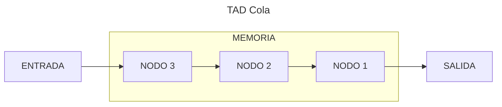
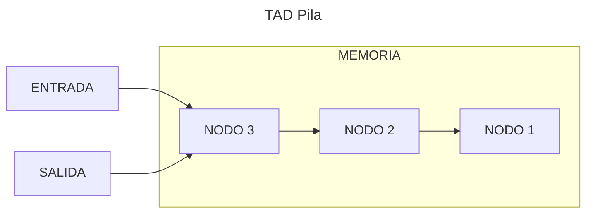

<!--
SPDX-FileCopyrightText: 2024 Pablo Portas López <pablo.portas@udc.es>

SPDX-License-Identifier: CC-BY-NC-4.0
-->

<web-summary rel="tldr"/>

<tip>Copyright © 2024 Pablo Portas López</tip>

# Tema 4 y 5 - Colas y Pilas

<tldr id="tldr">

El TAD Cola y el TAD Pila, especificación informal, implementación y descripción gráfica. Diferencias entre ambos
explicadas.

Implementaciones con array circular, lista dinámica circular y a partir del TAD Lista. Operaciones explicadas de
forma gráfica.

</tldr>

<include from="Para-Colaboradores.md" element-id="en-construccion"></include>

<note>

Para ver las diferencias entre los dos TADs: 

</note>

## TAD Colas

Una cola es una secuencia de cero o más elementos del mismo tipo. Los elementos de una cola están ordenados de una forma
lineal, no por su contenido, sino por la posición que ocupan.

Cuando un elemento es insertado se añade al principio de la cola. Para eliminar o extraer un elemento, solo se podrá eliminar el
primero, que fue el primero en ser insertado. Este concepto es descrito como **FIFO** (First in, first out).

<note>

Para saber más sobre FIFO. [Wikipedia](https://es.wikipedia.org/wiki/First_in,_first_out)

</note>

### Operaciones {id="cola-operaciones"}

Siguiendo los pasos para la especificación de un TAD, definimos las operaciones del mismo clasificándolas en:
constructoras, generadoras, modificadoras, observadoras y destructoras.

<note>

Para más información: 

</note>

#### Generadoras {id="cola-generadoras"}

<list>
<li>
<code-block lang="tex"> createEmptyQueue \rightarrow Queue </code-block> 

Objetivo: Crea una cola vacía 
Salida: Una cola vacía 
PosCondición: La cola sin datos 

<code-block lang="c" src="./Ejemplos/Tema_4/createEmptyQueue.c" collapsible="true" collapsed-title="Mostrar implementación"/>
</li>
<li>
<code-block lang="tex"> enqueue (Item, Quede) \rightarrow Quede, bool </code-block> 

Objetivo: Inserta un elemento en la cola quedando al final. 
Entrada: 
Item: Contenido del elemento a insertar. 
Queue: Cola donde vamos a insertar. 
Salida: Queue: Cola con el elemento Item insertado y verdadero si se ha podido insertar, falso en caso contrario. 

<code-block lang="c" src="./Ejemplos/Tema_4/enqueue.c" collapsible="true" collapsed-title="Mostrar implementación"/>
</li>
</list>

#### Destructoras {id="cola-destructoras"}

<list>
<li>
<code-block lang="tex"> dequeue(Queue) \rightarrow Queue </code-block> 

Objetivo: Elimina el primer elemento de la cola 
Entrada: Queue: Cola a modificar 
Salida: Queue: Cola sin el primer elemento 
Precondición: La cola no está vacía 

<code-block lang="c" src="./Ejemplos/Tema_4/dequeue.c" collapsible="true" collapsed-title="Mostrar implementación"/>
</li>
</list>

#### Observadoras {id="cola-observadoras"}

<list>
<li>
<code-block lang="tex"> front(Queue) \rightarrow Item </code-block> 

Objetivo: Recupera el contenido del primer elemento de la cola 
Entrada: Queue: Cola donde obtener el dato 
Salida: Item: Contenido del primer elemento de la cola 
Precondición: La cola no está vacía 

<code-block lang="c" src="./Ejemplos/Tema_4/front.c" collapsible="true" collapsed-title="Mostrar implementación"/>
</li>
<li>
<code-block lang="tex"> isEmptyQueue(Queue) \rightarrow bool </code-block> 

Objetivo: Determina si la cola está vacía 
Entrada: Queue: Cola a comprobar 
Salida: Verdadero si la cola está vacía, falso en caso contrario 

<code-block lang="c" src="./Ejemplos/Tema_4/isEmptyQueue.c" collapsible="true" collapsed-title="Mostrar implementación"/>
</li>
</list>

### Implementación con array circular

<include from="Para-Colaboradores.md" element-id="en-construccion"></include>

### Implementación con lista dinámica circular

<include from="Para-Colaboradores.md" element-id="en-construccion"></include>

### Implementación a partir del TAD Lista

<note>

Esta implementación se basa en el .

</note>

<include from="Para-Colaboradores.md" element-id="en-construccion"></include>

## TAD Pilas

Una pila es una secuencia de cero o más elementos del mismo tipo. Los elementos de una cola están ordenados de una forma
lineal, no por su contenido, sino por la posición que ocupan.

Cuando un elemento es insertado se añade al principio de la pila. Para extraer o eliminar un elemento solo se puede el
primer elemento, que fue último en añadirse. Este concepto es descrito como **LIFO** (Last in, first out).

<note>

Para saber más sobre LIFO. [Wikipedia](https://es.wikipedia.org/wiki/Last_in,_first_out)

</note>

### Operaciones {id="pila-operaciones"}

Siguiendo los pasos para la especificación de un TAD, definimos las operaciones del mismo clasificándolas en:
constructoras, generadoras, modificadoras, observadoras y destructoras.

<note>

Para más información: 

</note>

#### Generadoras {id="pila-generadoras"}

<list>
<li>
<code-block lang="tex"> createEmptyStack \rightarrow Stack </code-block> 

Objetivo: Crea una pila vacía 
Salida: Una pila vacía 
PosCondición: La pila sin datos 

<code-block lang="c" src="./Ejemplos/Tema_5/createEmptyStack.c" collapsible="true" collapsed-title="Mostrar implementación"/>
</li>
<li>
<code-block lang="tex"> push (Item, Quede) \rightarrow Stack, bool </code-block> 

Objetivo: Inserta un elemento en la cola quedando al final. 
Entrada: 
Item: Contenido del elemento a insertar. 
Queue: Cola donde vamos a insertar. 
Salida: Stack: Cola con el elemento Item insertado y verdadero si se ha podido insertar, falso en caso contrario. 

<code-block lang="c" src="./Ejemplos/Tema_5/push.c" collapsible="true" collapsed-title="Mostrar implementación"/>
</li>
</list>

#### Destructoras {id="pila-destructoras"}

<list>
<li>
<code-block lang="tex"> pop(Stack) \rightarrow Stack </code-block> 

Objetivo: Saca el elemento de la cima de la pila 
Entrada: Stack: Pila de donde vamos a sacar 
Salida: Stack: Pila sin el elemento de su cima 
Precondición: La pila no está vacía 

<code-block lang="c" src="./Ejemplos/Tema_5/pop.c" collapsible="true" collapsed-title="Mostrar implementación"/>
</li>
</list>

#### Observadoras {id="pila-observadoras"}

<list>
<li>
<code-block lang="tex"> peek(Stack) \rightarrow Item </code-block> 

Objetivo: Recupera el contenido del elemento de la cima de la pila 
Entrada: Stack: Pila donde obtener el datoo 
Salida: Item: Contenido del elemento de la cima de la pila 
Precondición: La pila no está vacía 

<code-block lang="c" src="./Ejemplos/Tema_5/peek.c" collapsible="true" collapsed-title="Mostrar implementación"/>
</li>
<li>
<code-block lang="tex"> isEmptyStack(Stack) \rightarrow bool </code-block> 

Objetivo: Determina si una pila está vacía 
Entrada: Stack: Pila a comprobar 
Salida: Verdadero si la pila está vacía, falso en caso contrario 

<code-block lang="c" src="./Ejemplos/Tema_5/isEmptyStack.c" collapsible="true" collapsed-title="Mostrar implementación"/>
</li>
</list>

## TAD Cola vs TAD Pila