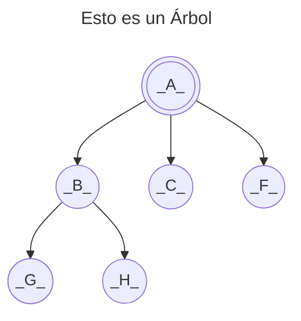
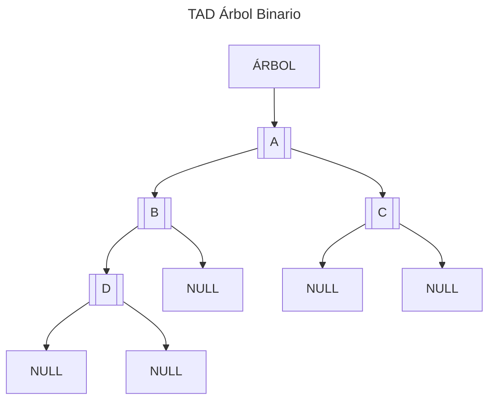

<!--
SPDX-FileCopyrightText: 2024 Pablo Portas López <pablo.portas@udc.es>

SPDX-License-Identifier: CC-BY-NC-4.0
-->

<web-summary rel="tldr"/>

<tip>Copyright © 2024 Pablo Portas López</tip>

# Tema 6 - Árboles

<tldr id="tldr">

El TAD Árbol Binario, especificación informal, implementación y descripción gráfica. Operaciones explicadas de forma
gráfica e implementadas.

</tldr>

<include from="Para-Colaboradores.md" element-id="en-construccion"></include>

## ¿Que es un árbol?

Definido por:

- Una raíz: `A`, padre de `B`, `C` y `F`.
- `G` hermanos `H`, hijos de `B` y descendientes de `A`.
- Altura del árbol: `3`
- Grado del árbol: `3` (Nº de hijos máximo, alcanzado por `A`)

<note>

Para más sobre árboles en la informática: [Wikipedia](https://es.wikipedia.org/wiki/Arbol_(informatica))

</note>

Para trabajar con **Árboles Binarios** es importante tener claro el concepto de **árbol lleno** y **árbol completo**.

<table>
<tr><td>Árbol Lleno</td><td>Árbol Completo</td></tr>
<tr><td>
<control>Todas sus hojas están al mismo nivel</control> <code>h</code> y todos los nodos anteriores
tienen el <control>número máximo de hijos</control> (en un árbol binario, 2).
</td><td>
<control>Todas sus hojas llenas hasta</control> <code>h-1</code> y <control>todos los nodos del nivel</control> <code>h</code> están lo más a la <control>izquierda</control> posible.
</td></tr>
<tr><td> 
<code-block lang="mermaid">
flowchart TB
A(((_A_))) --&gt; B((_B_)) &amp; C((_C_))
B --&gt; D((_D_)) &amp; E((_E_))
C --&gt; F((_F_)) &amp; G((_G_))
</code-block>
</td><td>
<code-block lang="mermaid">
flowchart TB
A(((_A_))) --&gt; B((_B_)) &amp; C((_C_))
B --&gt; D((_D_)) &amp; E((_E_))
C --&gt; F((_F_)) &amp; NULL(NULL)
</code-block>
</td></tr>
</table>

## TAD Árbol Binario

Un árbol binario es un conjunto cero o más de elementos del mismo tipo llamados nodos.

- O bien 0 nodos, en cuyo casa: **árbol vacío**
- O bien existe un elemento distinguido **llamado raíz**, y el resto de los nodos se distribuyen en dos subconjuntos, y a su
  vez cada nodo tiene una serie de **hasta dos hijos** los cuales solo pueden tener **hasta dos hijos**. Formando así los
  subconjuntos siguientes.

### Operaciones

Siguiendo los pasos para la especificación de un TAD, definimos las operaciones del mismo clasificándolas en:
constructoras, generadoras, modificadoras, observadoras y destructoras.

<note>

Para más información: 

</note>

#### Generadoras

<list>
<li>
<code-block lang="tex"> createEmptyTree \rightarrow Tree </code-block> 

Objetivo: Crea un árbol vacío 
Salida: Un árbol vacía 
PosCondición: El árbol sin datos 

<code-block lang="mermaid">
flowchart LR
    TREE[ÁRBOL] --&gt; NULL
</code-block>
<code-block lang="c" src="./Ejemplos/Tema_6/createEmptyTree.c" collapsible="true" collapsed-title="Mostrar implementación"/>
</li>
<li>
<code-block lang="tex"> BuildTree (Tree, Item, Tree) \rightarrow Tree, bool </code-block> 

Objetivo: Crea un árbol con cierta información en la raíz y como hijos los árboles que se reciben en las entradas. 
Entrada:  
- Tree(1): Árbol que constituirá el hijo izquierdo. 
- Item: Contenido del elemento raíz. 
- Tree(2): Árbol que constituirá el hijo derecho. 
Salida: Tree: Nuevo árbol construido y verdadero si se ha podido construir, falso en caso contrario. 

<code-block lang="mermaid">
flowchart TB
TREE1[ÁRBOL1] --&gt; A[[A]] --&gt; B[[B]] &amp; C[[C]]
ITEM
TREE2[ÁRBOL2] --&gt; 1[[1]] --&gt; 2[[2]] &amp; 3[[3]]
</code-block>
<code-block lang="mermaid">
flowchart TB
TREE1[ÁRBOL1] --&gt; A[[A]] --&gt; B[[B]] &amp; C[[C]]
TREE3[ÁRBOL] --&gt; ITEM[[ITEM]]
TREE2[ÁRBOL2] --&gt; 1[[1]] --&gt; 2[[2]] &amp; 3[[3]]
</code-block>
<code-block lang="mermaid">
flowchart TB
TREE1[ÁRBOL1] -.-&gt; A[[A]] --&gt; B[[B]] &amp; C[[C]]
TREE3[ÁRBOL] --&gt; ITEM[[ITEM]] --&gt; A &amp; 1
TREE2[ÁRBOL2] -.-&gt; 1[[1]] --&gt; 2[[2]] &amp; 3[[3]]
</code-block>
<code-block lang="c" src="./Ejemplos/Tema_6/buildTree.c" collapsible="true" collapsed-title="Mostrar implementación"/>
</li>
</list>

#### Observadoras

<list>
<li>
<code-block lang="tex"> leftChild(Tree) \rightarrow Tree </code-block> 

Objetivo: Devuelve el árbol que constituye el hijo izquierdo del árbol 
Entrada: Tree: Árbol a manipular 
Salida: Tree: Árbol que constituye el hijo izquierdo o nulo del árbol 
Precondición: El árbol no está vacío 

<code-block lang="c" src="./Ejemplos/Tema_6/leftChild.c" collapsible="true" collapsed-title="Mostrar implementación"/>
</li>
<li>
<code-block lang="tex"> rightChild(Tree) \rightarrow bool </code-block> 

Objetivo: Devuelve el árbol que constituye el hijo derecho del árbol 
Entrada: Tree: Árbol a manipular 
Salida: Tree: Árbol que constituye el hijo derecho o nulo del árbol 
Precondición: El árbol no está vacío 

<code-block lang="c" src="./Ejemplos/Tema_6/rightChild.c" collapsible="true" collapsed-title="Mostrar implementación"/>
</li>
<li>
<code-block lang="tex"> root(Tree) \rightarrow Item </code-block> 

Objetivo: Devuelve el dato de la raíz del árbol 
Entrada: Tree: Árbol a manipular 
Salida: Item: Contenido del elemento de la raíz 
PreCondición: El árbol no está vacío 

<code-block lang="c" src="./Ejemplos/Tema_6/root.c" collapsible="true" collapsed-title="Mostrar implementación"/>
</li>
<li>
<code-block lang="tex"> isEmptyTree(Tree) \rightarrow bool </code-block> 

Objetivo: Determina si el árbol está vacío 
Entrada: Tree: Árbol a manipular 
Salida: Verdadero si el árbol está vacía, falso en caso contrario 

<code-block lang="c" src="./Ejemplos/Tema_6/isEmptyTree.c" collapsible="true" collapsed-title="Mostrar implementación"/>
</li>
</list>

## Recorridos de Árboles

<include from="Para-Colaboradores.md" element-id="en-construccion"></include>