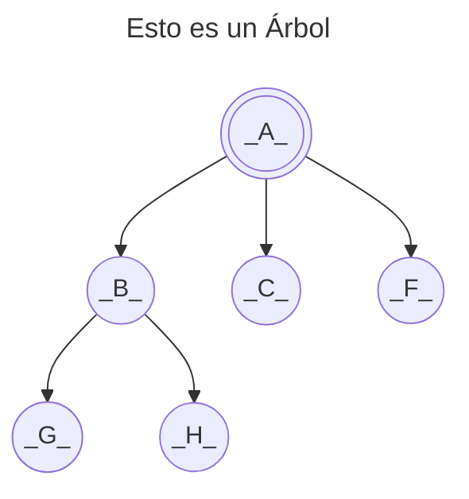

<!--
SPDX-FileCopyrightText: 2024 Pablo Portas López <pablo.portas@udc.es>

SPDX-License-Identifier: CC-BY-NC-4.0
-->

<web-summary rel="tldr"/>

<tip>Copyright © 2024 Pablo Portas López</tip>

# Tema 6 - Árboles

<tldr id="tldr">

El TAD Árbol Binario, especificación informal, implementación y descripción gráfica. Operaciones explicadas de forma
gráfica e implementadas.

</tldr>

## ¿Que es un árbol?

Definido por:

- Una raíz: `A`, padre de `B`, `C` y `F`.
- `G` hermanos `H`, hijos de `B` y descendientes de `A`.
- Altura del árbol: `3`
- Grado del árbol: `3` (Nº de hijos máximo, alcanzado por `A`)

<note>

Para más sobre árboles en la informática: [Wikipedia](https://es.wikipedia.org/wiki/Arbol_(informatica))

</note>

Para trabajar con **Árboles Binarios** es importante tener claro el concepto de **árbol lleno** y **árbol completo**.

<table>
<tr><td>Árbol Lleno</td><td>Árbol Completo</td></tr>
<tr><td>
<control>Todas sus hojas están al mismo nivel</control> <code>h</code> y todos los nodos anteriores
tienen el <control>número máximo de hijos</control> (en un árbol binario, 2).
</td><td>
<control>Todas sus hojas llenas hasta</control> <code>h-1</code> y <control>todos los nodos del nivel</control> <code>h</code> están lo más a la <control>izquierda</control> posible.
</td></tr>
<tr><td> 
<code-block lang="mermaid">
flowchart TB
A(((_A_))) --&gt; B((_B_)) &amp; C((_C_))
B --&gt; D((_D_)) &amp; E((_E_))
C --&gt; F((_F_)) &amp; G((_G_))
</code-block>
</td><td>
<code-block lang="mermaid">
flowchart TB
A(((_A_))) --&gt; B((_B_)) &amp; C((_C_))
B --&gt; D((_D_)) &amp; E((_E_))
C --&gt; F((_F_))
</code-block>
</td></tr>
</table>

## TAD Árbol Binario

Un árbol binario es un conjunto cero o más de elementos del mismo tipo llamados nodos.

