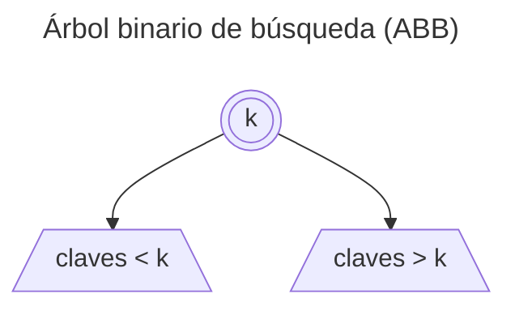
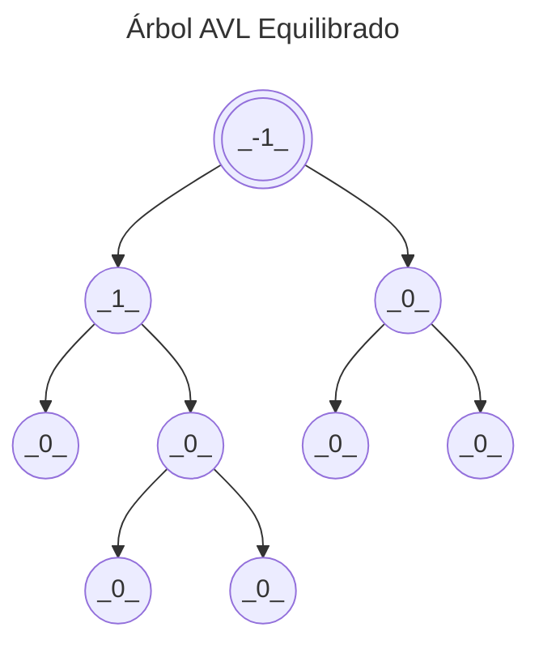
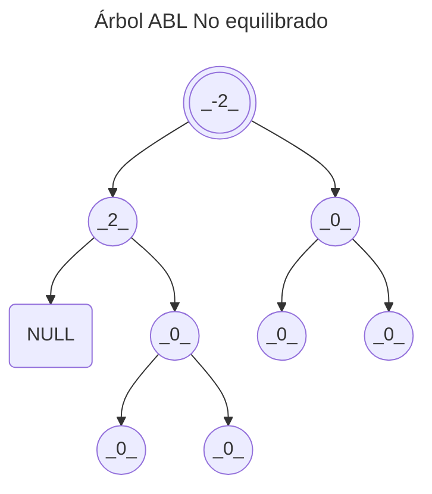

<!--
SPDX-FileCopyrightText: 2024 Pablo Portas López <pablo.portas@udc.es>

SPDX-License-Identifier: CC-BY-NC-4.0
-->

<web-summary rel="tldr"/>

<tip>Copyright © 2024 Pablo Portas López</tip>

# Tema 7 y 8 - Árboles Binarios de Búsqueda ABB y Equilibrados AVL

<tldr id="tldr">

El TAD Árbol Binario de Búsqueda ABB y el TAD Árbol Binario de Búsqueda AVL, especificación informal, implementación y
descripción gráfica. Operaciones explicadas de forma gráfica e implementadas. Rotaciones (LL, RR, LR y RL) y factor de
equilibrio.

</tldr>

<include from="Para-Colaboradores.md" element-id="en-construccion"></include>

## TAD Árbol Binario de Búsqueda ABB

### Definición {id=abb-definicion}

- Es un árbol binario.
- Tiene asociada una clave de ordenación _k_.
- Cumple para cualquier nodo _T_ del árbol:
    - los valores de los nodos del subárbol **izquierdo** de _T_ son **menores** que el valor de _T_.
    - los valores de los nodos del subárbol **derecho** son _T_ mayores que el valor de _T_.

- **Mayor eficiencia** frente a...
    - estructuras **estadísticas** en operaciones de **inserción** y **eliminación**.
    - estructuras **dinámicas** en la operación de **búsqueda**.



### Pros y contras

- Eficiencia del proceso de búsqueda en árboles equilibrados
- Si los nodos se añaden en un orden aleatorio habrá que equilibrarlo
  ```mermaid
  ---
  title: Árbol sin equilibrar
  ---
  flowchart TB
    k[[6]] --> 1[[1]] & 8[[8]]
    1 --> 0[[0]] & 2[[2]]
    2 --> NULL[[NULL]] & 4[[4]]
    8 --> 7[[7]]
  ```
- Si los nodos se añaden en un orden determinado el árbol degenerará en una lista ordenada
  ```mermaid
  ---
  title: Árbol degenerado en lista
  ---
  flowchart TB
  k[[4]] -->  3[[3]] & NULL1[[NULL]]
  3 --> 2[[2]] & NULL2[[NULL]] 
  2 --> 1[[1]] & NULL3[[NULL]]
  ```

### Operaciones {id=abb-operaciones}

Basándonos en el [TAD Árbol](Tema-6-Arboles.md#operaciones) definimos las operaciones del árbol de búsqueda a cambiar.

<note>

Para más información: [TAD Árbol](Tema-6-Arboles.md#operaciones)
y [](Tema-1-Tipos-Abstractos-de-Datos-TAD.md#especificaci-n-de-un-tad)

</note>

#### Generadoras

<list>
<li>
<code-block lang="tex"> createEmptyTree \rightarrow Tree </code-block><br/>
</li>
<li>
<code-block lang="tex"> insertKey(Tree, Key) \rightarrow Tree, bool </code-block><br/>
<p>
Objetivo: Insertar un nodo con información en el árbol, en su lugar correspondiente, de acuerdo al valor de una clave<br/>
Entrada: <br/>
- Tree: Árbol a modificar<br/>
- Key: Dato a insertar<br/>
Salida: Tree: Nuevo árbol que resulta de la inserción y verdadero si se ha podido insertar o si la clave existe, falso en caso contrario.<br/>
Poscondición: El árbol incorpora un nuevo nodo con los datos si éstos no existían en el árbol
</p>
<code-block lang="mermaid">
flowchart TB
    Key(Key: 25)
    K[[30]] --&gt; A[[20]] &amp; B[[40]]
    A --&gt; NULL[[NULL]] &amp; C[[25]]
    K -. 25 &lt; 30 .-&gt; A -. 25 &gt; 20 .-&gt; C
</code-block>
<code-block lang="c" src="./Ejemplos/Tema_7/insertKey.c" collapsible="true" collapsed-title="Mostrar implementación"/>
</li>
</list>

#### Observadoras

<list>
<li>
<code-block lang="tex"> leftChild(Tree) \rightarrow Tree </code-block><br/>
</li>
<li>
<code-block lang="tex"> rightChild(Tree) \rightarrow bool </code-block><br/>
</li>
<li>
<code-block lang="tex"> root(Tree) \rightarrow Item </code-block><br/>
</li>
<li>
<code-block lang="tex"> isEmptyTree(Tree) \rightarrow bool </code-block><br/>
</li>
<li>
<code-block lang="tex"> findKey(Key, Tree) \rightarrow Tree </code-block>
<p>
Objetivo: Devuelve el subárbol cuya raíz contiene la clave<br/>
Entrada: <br/>
- Key: Dato a buscar<br/>
- Tree: Árbol a manipular<br/>
Salida: Tree: Acceso al árbol cuya raíz contiene la clave, o nulo si éste no existe (el árbol está vacío o no contiene esa clave)<br/>
</p>
<code-block lang="mermaid">
flowchart TB
    key(Key: 25)
    k[[30]] --&gt; A[[20]] &amp; B[[40]]
    A --&gt; D[[15]] &amp; E[[25]]
    B --&gt; F[[35]] &amp; G[[45]]
    k -. 25 &lt; 30 .-&gt; A -. 25 &gt; 20 .-&gt; E  
</code-block>
<code-block lang="c" src="./Ejemplos/Tema_7/findKey.c" collapsible="true" collapsed-title="Mostrar implementación"/>
</li>
</list>

#### Destructoras

<list>
<li>
<code-block lang="tex"> removeKey(Key, Tree) \rightarrow Tree </code-block>
<p>
Objetivo: Eliminar el nodo cuyo contenido coincide con la clave<br/>
Entrada: <br/>
- Key: Clave del nodo a eliminar<br/>
- Tree: Árbol a modificar<br/>
Salida: Tree: Nuevo árbol sin el nodo eliminado<br/>
Precondición: La clave existe en el árbol<br/>
</p>
<note>Se deben tener en cuenta los hijos del nodo a borrar, ya que deben continuar en el árbol. Si el nodo tienen dos hijos, se sustituye por el mayor de los hijos menores (subárbol izquierdo).</note>
<code-block lang="mermaid">
flowchart TB
    key(A eliminar: 87)
    A[[120]] --&gt; B[[87]] &amp; C[[140]]
    B --&gt; D[[43]] &amp; E[[93]]
    D --&gt; NULL1(NULL) &amp; F[[65]]
    F --&gt; G[[56]] &amp; NULL2(NULL)
</code-block>
<code-block lang="mermaid">
flowchart TB
    key(A eliminar: 87)
    A[[120]] --&gt; B[[87]] &amp; C[[140]]
    B --&gt; D[[43]] &amp; E[[93]]
    subgraph Subárbol izquierdo
        D --&gt; NULL1(NULL) &amp; F[[65]]
        F --&gt; G[[56]] &amp; NULL2(NULL)
    end
</code-block>
<code-block lang="mermaid">
flowchart TB
    key(A eliminar: 87)
    A[[120]] --&gt; B[[87]] &amp; C[[140]]
    B --&gt; D[[43]] &amp; E[[93]]
    subgraph Subárbol izquierdo
        D --&gt; NULL1(NULL) &amp; F[[65]]
        F --&gt; G[[56]] &amp; NULL2(NULL)
    end
    F -. el mayor .-&gt; B
</code-block>
<code-block lang="mermaid">
flowchart TB
    key(A eliminar: 87)
    A[[120]] --&gt; B[[65]] &amp; C[[140]]
    B --&gt; D[[43]] &amp; E[[93]]
    subgraph Subárbol izquierdo
        D --&gt; NULL(NULL) &amp; G[[56]]
    end
</code-block>
<code-block lang="c" src="./Ejemplos/Tema_7/removeKey.c" collapsible="true" collapsed-title="Mostrar implementación"/>
</li>
</list>

## Árboles Binarios de Búsqueda Equilibrados (AVL)

Un árbol binario de búsqueda equilibrado es un árbol de búsqueda (_redundante ya lo sé_) en el que, para cada
nodo, se cumple que la diferencia de altura de sus subárboles **nunca es mayor que uno** (las diferencias son en valor
absoluto, intervalo [-1, 1]).

Estos árboles hacen búsquedas **muy eficientes**, ya que mantienen **una altura mínima** evitando así los [**árboles
degenerados**](#pros-y-contras).

El **factor de equilibrio** (balance factor) de un nodo se define como la **altura de su subárbol derecho** menos
**altura de su subárbol izquierdo**. Para ser un AVL debes tener un **factor de equilibrio en cada nodo entre [-1, 1]**.

```tex
bf(N) = hNDch - hNIzq
```





<note>

Se denominan AVL en honor a Adelson, Velskii y Landis, que fueron los primeros en proponer este
TAD. [Wikipedia](https://es.wikipedia.org/wiki/Árbol_AVL)

</note>

### Operaciones {id=avl-operaciones}

Respecto a la [especificación del árbol binario de búsqueda ABB](#abb-operaciones) solo cambian las funciones de
inserción y borrados, que también deben **mantener equilibrado el árbol**.

Si el árbol está en perfecto equilibrio una inserción o un borrado no romperá el equilibrio. De no estarlo, una
inserción o un borrado podría romper el equilibrio.


Para solucionar estó debemos emplear [](#rotaciones-para-restaurar-el-equilibrio).

### Rotaciones para restaurar el equilibrio

- Rotaciones simples
    - Son aquellas que involucran a dos nodos.
    - La rotación left-left (LL) y la rotación right-right (RR).
- Rotaciones complejas
    - Son aquellas que involucran a tres nodos.
    - Tenemos la rotación right-left (RL) y la rotación left-right (LR).

Ejemplos gráficos:

<include from="Para-Colaboradores.md" element-id="en-construccion"></include>