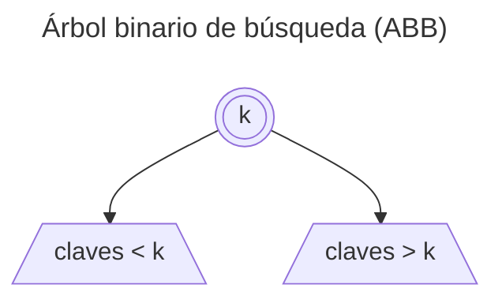

<!--
SPDX-FileCopyrightText: 2024 Pablo Portas López <pablo.portas@udc.es>

SPDX-License-Identifier: CC-BY-NC-4.0
-->

<web-summary rel="tldr"/>

<tip>Copyright © 2024 Pablo Portas López</tip>

# Tema 7 y 8 - Árboles Binarios de Búsqueda ABB y Equilibrados AVL

<tldr id="tldr">

El TAD Árbol Binario de Búsqueda ABB y el TAD Árbol Binario de Búsqueda AVL, especificación informal, implementación y
descripción gráfica. Operaciones explicadas de forma gráfica e implementadas.

</tldr>

## TAD Árbol Binario de Búsqueda ABB

### Definición {id=abb-definicion}

- Es un árbol binario.
- Tiene asociada una clave de ordenación _k_.
- Cumple para cualquier nodo _T_ del árbol:
    - los valores de los nodos del subárbol **izquierdo** de _T_ son **menores** que el valor de _T_.
    - los valores de los nodos del subárbol **derecho** son _T_ mayores que el valor de _T_.

- **Mayor eficiencia** frente a...
    - estructuras **estadísticas** en operaciones de **inserción** y **eliminación**.
    - estructuras **dinámicas** en la operación de **búsqueda**.



### Pros y contras

- Eficiencia del proceso de búsqueda en árboles equilibrados
- Si los nodos se añaden en un orden aleatorio habrá que equilibrarlo
  ```mermaid
  ---
  title: Árbol sin equilibrar
  ---
  flowchart TB
    k[[6]] --> 1[[1]] & 8[[8]]
    1 --> 0[[0]] & 2[[2]]
    2 --> 3[[3]] --> 4[[4]]
    8 --> 7[[7]]
  ```
- Si los nodos se añaden en un orden determinado el árbol degenerará en una lista ordenada
  ```mermaid
  ---
  title: Árbol degenerado en lista
  ---
  flowchart TB
  k[[4]] -->  3[[3]] & NULL1[[NULL]]
  3 --> 2[[2]] & NULL2[[NULL]] 
  2 --> 1[[1]] & NULL3[[NULL]]
  ```


