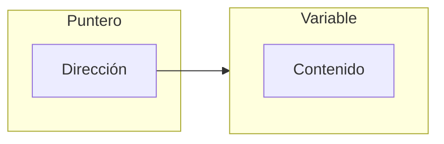
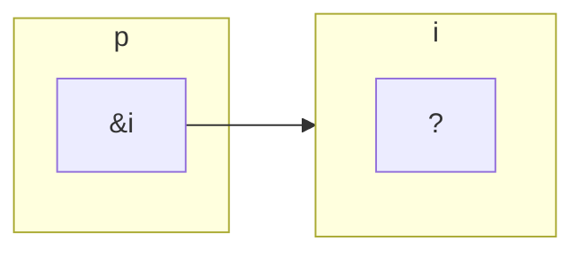

<!--
SPDX-FileCopyrightText: 2024 Daniel Feito Pin

SPDX-License-Identifier: CC-BY-NC-4.0
-->

<tip>Copyright © 2024 Daniel Feito Pin</tip>

# Bloque 1 - Conceptos Básicos

<tldr>Algoritmos, lenguajes de programación, programas y sus elementos, tipos de datos y operadores, entrada y salida (printf / scanf), conceptos básicos de macros e introducción a los punteros.</tldr>

## Introducción

La **programación** busca resolver **problemas** mediante la construcción de **programas** ejecutables en un *
*computador**.

<deflist>
<def title="Programa">

- Conjunto unitario de instrucciones que permite a una computadora realizar funciones diversas, como el tratamiento de
  textos, el diseño de gráficos, la resolución de problemas matemáticos, el manejo de bancos de datos, etc.
- Codificación en cualquier lenguaje de programación específico de uno o varios algoritmos.

</def>

<def title="Computador">

Máquina electrónica que, mediante determinados programas, permite almacenar y tratar información, y resolver problemas
de diversa índole.

</def>
</deflist>

Los **lenguajes de programación** están diseñados de forma que sólo se requiere que los programadores indiquen sus
intenciones explícitamente.

## Algoritmos

<deflist>
<def title="Algoritmo">

Conjunto ordenado y finito de operaciones que permite hallar la solución de un problema.

</def>
</deflist>

Condiciones necesarias:

- Finitud.
- No ambigüedad.

Propiedades deseables:

- Generalidad.
- Eficiencia.
- Independencia del medio de ejecución.

### Representación de algoritmos

- Lenguaje natural.
- Pseudocódigo.
- Diagramas de flujo u ordinogramas.
- Diagramas N-S (Nassi-Schneiderman).
- Métodos formales matemáticos.

#### Diagramas de flujo u ordinogramas

Un diagrama de flujo es la representación gráfica de un algoritmo o proceso.

|                                                                           Forma                                                                           |     Nombre     |         Forma         | Descripción                                                                                                                                                                        |
|:---------------------------------------------------------------------------------------------------------------------------------------------------------:|:--------------:|:---------------------:|:-----------------------------------------------------------------------------------------------------------------------------------------------------------------------------------|
|    | Línea de flujo |        Flecha         | Línea saliendo de un símbolo y apuntando a otro.                                                                                                                                   |
|  |    Terminal    |         Óvalo         | Inicio o fin de un programa o subprocesos.                                                                                                                                         |
|     |    Proceso     |    ​    Rectángulo    | Conjunto de operaciones que cambian el valor, forma o ubicación de datos.                                                                                                          |
|  |    Decisión    |      ​    Rombo       | ​    Muestra una operación condicional que determina cuál de los dos caminos tomará el programa. La operación es comúnmente una pregunta de sí/no o una prueba de verdadero/falso. |
|               |    Entrada     |    ​Paralelogramo     | Proceso de hacer entrar datos​ en la forma de ingresar datos.                                                                                                                      |
|    |     Salida     | Hoja de papel impresa | Proceso de hacer salir datos, en la forma de mostrar resultados.                                                                                                                   |

### Pseudocódigo

Descripción de alto nivel compacta e informal del principio operativo de un programa informático u otro algoritmo.

Utiliza las convenciones estructurales de un lenguaje de programación real, pero está diseñado para la lectura humana en
lugar de la lectura mediante máquina, y con independencia de cualquier otro lenguaje de programación.

## Lenguajes de programación

### Tipos de lenguajes de programación

#### Generaciones de los lenguajes de programación

1. Primera generación: Lenguaje máquina.
2. Segunda generación: Lenguajes de ensamblador.
3. Tercera generación: Lenguajes de alto nivel.
    - Lenguajes compilados.
    - Lenguajes interpretados.
    - Lenguajes híbridos.

#### Lenguajes compilados y lenguajes interpretados

Ejecución de un programa **compilado**:

- Se realiza previamente la **compilación** del **programa fuente** en la versión equivalente del programa en **lenguaje
  máquina**.
    - Esta versión se conoce como **programa objeto**.
- El **programa objeto** se une, eventualmente, con los **subprogramas de biblioteca** descritos en el programa fuente
  para obtener el **programa ejecutable**.
    - Esto lo realiza el montador de enlaces (_linker_).
- Se inica el **programa ejecutable**.

Ejecución de un programa **interpretado**:

- Se iteran los siguientes pasos:
    - Obtención de la siguiente **instrucción** a ejecutar del **código fuente**.
    - **Análisis** de la **instrucción** y **determinación** de las **acciones** a ejecutar.
    - **Ejecución** de las correspondientes **acciones**.

### Propiedades deseables de los lenguajes de programación

- Claridad.
- Buena definición.
- Independencia de la máquina.
- Notación estándar.
- Niveles de abstracción.
- Control de errores.
- Verificación de programas.

### Paradigmas de programación

- Imperativa.
    - `C`, `Pascal`, `Cobol`, `Fortran`...
- Orientada a Objetos.
    - `Java`, `C++`, `C#`, `.NET`...
- Funcional.
    - `LISP`, `Scheme`, `ML`...
- Lógica o declarativa
    - `PROLOG`...
- Concurrente.
- Tiempo real.

### Instrucciones

- **Asignación**: Evaluar una expresión y almacenar el resultado en una variable.
    - `a = b + c`.
- **Entrada** / **Salida**: Transferencia de información con el exterior a través de dispositivos de entrada (teclado,
  ficheros, etc.) y salida (monitor, impresora, etc.).
    - `printf`, `scanf`...
- **Control de flujo**:
    - Condiciones: `if` , `if-else`, `switch`...
    - Bucles: `while`, `do-while`, `for`...
- **Llamada y retorno de subrutina**s: Dividir el programa en pequeñas unidades que se ejecutarán cuando convenga.

### Elementos

- **Alfabeto**: conjunto de símbolos válidos para construir textos en el lenguaje.
    - Palabras clave: `if`, `else`, `while`...
    - Caracteres: `a`...`z`, `A`...`Z`, `#`, `?`...
    - Dígitos: `0`...`9`.
    - Otros símbolos: `.`, `,`, `'`, `;`, `()`, `{}`...
- **Léxico**: vocabulario formado a partir del alfabeto.
- **Sintaxis**: conjunto de reglas gramaticales que permiten derivar frases correctas en el lenguaje.
    - Notaciones para expresar las reglas:
        - Backus-Naur.
        - Grafo Sintáctico.
- **Semántica**: conjunto de reglas que permiten derivar frases con sentido o significado en el lenguaje.

#### Notación BNF

Creada por J. Backus y P. Naur para describir la sintaxis del
lenguaje ALGOL 60.

Para describir el lenguaje se utilizan reglas que se construyen con tres tipos de símbolos:

- **Metasímbolos**: propios de la notación BNF.
- **Símbolos terminales**: se usan en el texto del programa tal y como aparecen en la regla (sin comillas).
- **Símbolos no terminales**: resto de símbolos. Se definen utilizando combinaciones de símbolos terminales, no
  terminales y metasímbolos

| Metasímbolo | Significado           |
|:-----------:|:----------------------|
|    `::=`    | Se define como        |
|    `\|`     | Opción alternativa    |
| `(a \| b)`  | a ó b pero no ambos   |
| `[palabra]` | 0 ó 1 vez palabra     |
| `{palabra}` | 0 ó más veces palabra |
|   `'xyz'`   | Símbolo terminal      |
|     `.`     | Final de la regla     |

Definición de un dígito con 10 reglas:

```BNF
digito ::= '0'.
digito ::= '1'.
digito ::= '2'.
digito ::= '3'.
digito ::= '4'.
digito ::= '5'.
digito ::= '6'.
digito ::= '7'.
digito ::= '8'.
digito ::= '9'.
```

Definición de un dígito con una única regla:

```BNF
digito ::= '0' | '1' | '2' | '3' | '4' | '5' | '6' | '7' | '8' | '9'.
```

Definición de un número entero:

```BNF
entero_sin_signo ::= digito {digito}.
signo ::= '+' | '-'.
entero ::= [signo] entero_sin_signo.
```

Definición de un identificador:

```BNF
identificador ::= letra { [ guion_bajo] (letra | digito) }
```

#### Diagramas de Conway

Herramienta gráfica para describir la sintaxis de un lenguaje.

Se utilizan también símbolos terminales y no terminales:

- Símbolos terminales: se representan por un círculo o rectángulo redondeado.
- Símbolos no terminales: se representan mediante un rectángulo.

Ambos símbolos se enlazan con flechas que indican el orden en que se debe realizar la interpretación de los diagramas.

## Programas

### Tipos de programas

- Programas de aplicación.
- Editores.
- Compiladores.
- Traductores.
- Montadores de enlace (_linkers_).
- Sistemas operativos.
- Programas de servicio.

#### Sistema Operativo

Conjunto de programas que tienen como objetivo:

- Facilitar la utilización del computador:
    - Acceso a los usuarios autorizados.
    - Edición de ficheros de texto.
    - Configuración y ejecución de programas.
    - Seguridad y protección
- Gestión óptima de la máquina:
    - Gestión de memoria.
    - Control de dispositivos periféricos.
    - Acceso a ficheros.
    - Asignación de recursos y ordenación de tareas.

### Elementos de un programa

Un programa se crea utilizando un alfabeto de símbolos (léxico) para construir:

- Identificadores.
- Etiquetas.
- Directivas remotas, de interface y de implementación.
- Constantes.
- Números sin signo, números reales...
- Cadenas de caracteres (_strings_) y variables.

#### Símbolos predefinidos

**Símbolos predefinidos**: conjunto de símbolos que constituyen el alfabeto del lenguaje.

En el caso de varios lenguajes de programación es el juego de caracteres ASCII.

Tabla ASCII de 7 bits:

- Cada símbolo una posición.
- Un número entero asociado a cada carácter.
- Los códigos 0-31 y 127 no son imprimibles.
- La diferencia entre el código ASCII de una letra mayúscula y su correspondiente minúscula es de 32.

#### Símbolos especiales

**Símbolos especiales**: símbolos con un significado especial dentro del lenguaje que se usan para representar
delimitadores, operadores y otros elementos sintácticos.

```BNF
special-symbol ::= '+' | '-' | '*' | '/' | '=' | '<' | '>' 
    | '{'  | '}' | '&' | ',' | ':' | ';' | '^' | '(' | ')' 
    | '[' | '' | '<=' | '>=' | '==' | '..' | '!=' 
    | word-symbol . 
```

#### Palabras reservadas

**Palabras reservadas** (_keywords_) se utilizan para especificar nombres de instrucciones, funciones de librería, tipos
de datos, operadores, etc.

- No se pueden redefinir para usarlas como identificadores.

```c++
auto        enum        restrict*       unsigned
break       extern      return          void
case        float       short           volatile
char        for         signed          while
const       goto        sizeof          _Bool*
continue     if         static          _Complex*
default     inline*     struct          _Imaginary*
do          int         switch
double      long        typedef
else        register    union
```

> \* palabras reservadas a partir del compilador `C99`.

#### Identificadores

**Identificadores**: son nombres que pueden utilizarse para denominar una función, una constante, una variable, un tipo,
una función, una interfaz...

```BNF
underscore ::= '_' .
identifier ::= letter { [ underscore ] ( letter | digit ) } .
```

El nombre debe ser apropiado y tener un significado adecuado al uso destinado para el identificador.

#### Constantes

**Constantes**: identificadores que se corresponden a un valor constante que no varía durante la ejecución del programa.

```BNF
constant-definition ::= identifier '=' constant-expression
```

#### Variables

**Variables**: identificadores que se corresponden a valores que pueden cambiar durante la ejecución de un programa,
permaneciendo dentro del rango establecido para su tipo.

Cuando se declara una variable:

- Se presenta el identificador, antes no existía.
- Se reserva la memoria necesaria para el tipo de datos de la variable.
- Se asocia el identificador con la dirección de memoria donde
  comienza.
- Se asocia el identificador con una cierta interpretación de memoria.

No adoptan valores hasta que el programa se los asigna, por ello es fundamental inicializarlas:

- En una instrucción de asignación.
- En la declaración.
- Mediante entrada por teclado.
- Llamando a una función.

Los tipos de variable y valor tienen que ser los mismos o compatibles.

#### Comentarios

**Comentarios**: sirven para documentar los programas, y no ejecutan ninguna acción.

Los comentarios pueden intercalarse en cualquier lugar de un
programa.

Los símbolos y formato de los comentarios dependen del lenguaje de programación utilizado.

## Tipos de Datos y Operadores

### Clasificaciones de los Tipos de Datos

Según sean sus constituyentes:

- Simples.
    - Numéricos.
    - Caracteres.
    - Punteros.
- Compuestos.
- Estructurados.
- No estructurados.

Según quien los haya definido:

- Predeterminados.
- Definidos por el usuario.
    - Enumerados.

Según la relación entre los valores de referencia:

- Ordinales.
- No ordinales.

Según la denominación:

- Con nombre.
- Sin nombre (Anónimos).

### Tipos de Operadores

- **Aritméticos**: proporcionan una ecuación para calcular un valor.

    - `+`, `-`, `*`, `/`, `%`.

- **Relacionales**: comparan dos expresiones de tipo ordinal, real, cadena de caracteres o conjunto, obteniendo un
  resultado de tipo lógico.

    - `<` , `>`, `<=` , `>=`, `==` (igual), `!=` (distinto).

- **Lógicos**: evalúan una o más expresiones lógicas, obteniendo como resultado otro valor lógico.

    - `&&` (AND lógico), `||` (OR lógico). `!` (NOT).

- **Lógicos binarios**: permiten manejar cada bit, de forma individual, en
  una palabra de memoria.

    - `&` (AND binario), `|` (OR binario), `^` ( XOR ).

Los distintos tipos de operadores tiene
diferente [precedencia](<https://en.cppreference.com/w/c/language/operator_precedence>) y asociatividad que depende del
lenguaje de programación.

### Efectos secundarios

Se dice que una función o expresión tiene efecto colateral o efecto secundario si esta, además de retornar un valor,
modifica el estado de su entorno.

### Conversión de tipos

En una expresión de asignación o una operación, pueden existir operandos de distinto tipo.

En estas situaciones se realiza una **conversion de tipos**, que puede ser:

- **implicita** si la realiza el propio compilador.
- **explicita** si la realiza en programador (_casting_).

Para realizar una conversión explícita, (_casting_) se especifica el tipo de dato entre paréntesis delante de la
expresión o variable a convertir.

### Definición de tipos

Para crear un nuevo tipo de datos en C, se utiliza la palabra reservada `typedef`:

```c
typedef tipo_de_datos nuevo_tipo;
```

### Tamaño de los Tipos de Datos

El operador `sizeof`, devuelve el tamaño en _bytes_ que ocupa un determinado tipo de datos o una variable.

### Rangos de los Tipos de Datos

#### Rangos de los Enteros

Rangos en una máquina de 64 _bits_:

|         Tipo         |     Mínimo      |      Máximo      |
|:--------------------:|:---------------:|:----------------:|
|     `short int`      |     –32,768     |      32,767      |
| `unsigned short int` |        0        |      65,535      |
|        `int`         | –2,147,483,648  |  2,147,483,647   |
|    `unsigned int`    |        0        |  4,294,967,295   |
|      `long int`      | –2<sup>63</sup> | 2<sup>63</sup>–1 |
| `unsigned long int`  |        0        | 2<sup>64</sup>–1 |

> Estos valores están definidos en `<limits.h>`.

#### Rangos de los Flotantes

Las características de `float` y `double` corresponden a un estándar IEEE:

|   Tipo   |           Mínimo            |           Máximo           | Precisión  |
|:--------:|:---------------------------:|:--------------------------:|:----------:|
| `float`  | 1.17549 × 10<sup>–38</sup>  | 3.40282 × 10<sup>38</sup>  | 6 digitos  |
| `double` | 2.22507 × 10<sup>–308</sup> | 1.79769 × 10<sup>308</sup> | 15 digitos |

Por defecto, las **constantes** de números en punto flotantes se almacenan como números de doble precisión.

- Para indicar que solo se desea una precisión simple se pone a letra `F` (o `f`) al final de la constante.
- Para indicar que una constante debe almacenarse en un formato doble largo, se pone la letra `L` (o `l`) al final.

### Tipo char

Cuando aparece un carácter (tipo `char`) en un cálculo, C usa su valor **entero**.

```c
#include <stdio.h>
int main() {
    int i;
    char ch;
    i='a'; /* i almacena el valor ascii de 'a', 97 */
    ch= 65; /* ch almacena el valor acii 65, que corresponde a 'A' */
    printf("%c %c %d %d\n" , i, ch, i, ch);
    return 0;
}
```

La salida de este programa es: `a A 97 65`.

C permite trabajar a la vez como `int` y como `char` un carácter.

### Notaciones comprimidas

| Notación larga | Notación comprimida |
|:--------------:|:-------------------:|
|  `a = a + b`   |      `a += b`       |
|  `a = a - b`   |      `a -= b`       |
|  `a = a * b`   |      `a *= b`       |
|  `a = a / b`   |      `a /= b`       |
|  `a = a % b`   |      `a %= b`       |
|  `a = a + 1`   |   `a++` o `++a` *   |
|  `a = a - 1`   |   `a--` o `--a` *   |

- Las expresiones `++` y `--` antes de la variable la modifican inmediatamente.
- Las expresiones `++` y `--` después de la variable devuelven su valor actual y luego la modifican.

```c
int i;
i = 1;
printf("i es %d\n", --i); /* imprime "i es 0" */
printf("i es %d\n", i); /* imprime "i es 0" */
i = 1;
printf("i es %d\n", i--); /* imprime "i es 1" */
printf("i es %d\n", i); /* imprime "i es 0" */
```

## Entrada / Salida

### Función printf

La función `printf` tiene asociado un formato: _format string_, seguido de los valores (variables que tienen que
mostrarse por pantalla).

```c
printf(string, expr1, expr2, ...);
```

La cadena de formato puede contener tanto caracteres ordinarios como especificaciones de conversión, que comienzan con
el carácter `%`.

- Una especificación de conversión es un marcador de posición que
  representa un valor que se debe completar durante la impresión.
    - `%d` se usa para valores enteros .
    - `%f` se usa para valores flotantes.
    - `%c` se usa para caracteres.

Los caracteres ordinarios en una cadena de formato se imprimen como aparecen en la cadena.

Ejemplo:

```c
int i, j;
float x, y;
i = 10;
j = 20;
x = 12.3456f;
y = 1234.0f;
printf("i = %d, j = %d, x = %f, y = %f \n", i, j, x, y);
```

Salida:

```
i = 10, j = 20, x = 12.345600, y = 1234.000000 
```

#### Consideraciones de conversión

Los compiladores **no** están obligados a:

- Verificar que el número de especificaciones de conversión en una cadena de formato coincida con el número de elementos
  de salida.

```c
printf ("%d %d \n", i); /* INCORRECTO */
printf ("%d \n", i, j); /* INCORRECTO */
```

- Verificar que una especificación de conversión sea apropiada.
    - Si el programador usa una especificación incorrecta, el programa producirá una salida sin sentido.

```c
/* i definido como int y x como float */
printf ("%f %d \n", i, x); /*INCORRECTO */
```

Una especificación de conversión puede tener la forma `%m.pX` o `%-m.pX`, donde `m` y `p` son constantes enteras y `X`
es una letra que indica el tipo de dato.

- `m` y `p` son opcionales.
    - Si se omite `p`, también se elimina el punto que separa `m` y `p`.
- `m`, el ancho de campo mínimo, especifica el número mínimo de caracteres para imprimir.
    - Si el valor a imprimir requiere menos de `m` caracteres, se justifica a la derecha dentro del campo.
    - Poner un signo menos delante de `m` causa justificación a la izquierda.
    - Si el valor que se va a imprimir requiere más de `m` caracteres, el ancho del campo se expande automáticamente al
      tamaño necesario.
- `p` indica el número mínimo de dígitos para mostrar.
    - Si se omite `p`, se supone que es 1.

##### Enteros

- `X` es `d`.
- Si `p` es más grande de lo necesario, se agregan ceros adicionales al comienzo del número.

##### Flotantes

- `X` puede ser:
    - `e`para formato exponencial.
        - `p` indica cuántos dígitos deben aparecer después del punto decimal.
        - El valor predeterminado es 6.
        - Si `p` es 0, no se muestra ningún punto decimal.
    - `f` para formato decimal fijo.
        - `p` tiene el mismo significado que para el especificador `e`.
    - `g` para formato exponencial o formato decimal fijo, según el tamaño del número.
        - `p` indica el número máximo de dígitos significativos que se mostrarán.
        - La conversión `g` no mostrará ceros finales.
        - Si el número no tiene dígitos después del punto decimal, no muestra el punto decimal.

##### Ejemplos

```c
#include <stdio.h>

int main() {
    int x = 123;
    float y = 337.21f;
    printf("|%d|%5d|%-5d|%5.4d|\n", x, x, x, x);
    printf("|%+10.7f|%10.3e|%-10g|\n", y, y, y);
    return 0;
}
```

```
|123|  123|123  | 0123|
|+337.2099915| 3.372e+02|337.21    |
```

#### Secuencias de escape

El código `\` que se usa en las cadenas de formato se llama secuencia de escape.

Las secuencias de escape permiten que las cadenas contengan caracteres no imprimibles (caracteres de control) y
caracteres que tienen un significado especial.

Algunas secuencias de escape son:

- `\a`: Alert (bell).
- `\b`: Backspace.
- `\n`: New line.
- `\t`: Horizontal tab.
- `\"`: Permite incluir `"` dentro de una cadena.
- `\\`: Permite incluir `\` dentro de una cadena.

### Función Scanf

`scanf` lee la entrada de acuerdo a un formato particular.

Una cadena de formato `scanf` puede contener tanto caracteres ordinarios como especificaciones de conversión.

- Las conversiones permitidas con `scanf` son esencialmente las mismas que las utilizadas por `printf`.

`scanf` intenta hacer coincidir grupos de caracteres de entrada con las especificaciones de conversión en la cadena de
formato.

- Para cada especificación de conversión, intenta localizar un elemento del tipo apropiado en los datos de entrada,
  omitiendo espacios en blanco si es necesario.
- Luego lee el elemento y se detiene cuando alcanza un carácter que no puede pertenecer al elemento.
- Si el elemento se leyó correctamente, continúa procesando el resto de la cadena de formato.
- Cuando busca un número, ignora los caracteres de espacio en blanco (espacio, tabulación horizontal y vertical, avance
  de página y nueva línea).

## Conceptos básicos de macros

### Directivas

La estructura básica de un programa en C es:

```c
/* Directivas */

int main() {
  /* Expresiones*/
}
```

Antes de compilar un programa, primero lo edita un **preprocesador**.

Los comandos destinados al preprocesador se denominan **directivas**.

- En C siempre comienzan con un `#`. Y no hay `;` ni otro marcador especial al final.

Ejemplo:

```c
#include <stdio.h>
```

`<stdio.h>` es un encabezado que contiene información sobre la biblioteca de E/S estándar de C.

### Definición de macros

Mediante la directiva `#define`, se pueden definir costantes que utilizar en el resto del programa.

Por ejemplo, si se emplea varias veces el valor de `π` , se puede escribir:

```c
#include<stdio.h>
#define PI 3.1415926
int main() {
    float radio=0, circulo=0;
    scanf(“"ntroduzca el radio del círculo %f: ", &radio);
    circulo = 2*PI*radio;
    printf("La longitude del círculo es de: %f\n", circulo);
    return 0
}
```

El preprocesador del compilador sustituye `PI` por su valor (`3.1415926`) en todo el texto del programa.

## Introducción a los Punteros

### Variables tipo Puntero

El primer paso para comprender los punteros es visualizar lo que representan a nivel de máquina:

- En la mayoría de las computadoras modernas, la memoria principal se divide en **_bytes_**, con cada _byte_ capaz de
  almacenar ocho _bits_ de información.
- Cada byte tiene una **única** dirección.
- Si hay n _bytes_ en la memoria, se puede interpretar en las direcciones como números que van de 0 a n-1.

Cada variable en un programa ocupa uno o más _bytes_ de memoria.

La **dirección del primer _byte_** se dice que es la **dirección de la variable**.

Las direcciones se pueden almacenar en variables de puntero especiales.

- Cuando se almacena la dirección de una variable en una variable de puntero se dice que la variable puntero apunta a la
  otra variable.



### Declaración de punteros

Cuando se declara una variable de puntero, su nombre debe ir precedido por un asterisco `*`:

Ejemplo:

```c
int *p;
```

`p` es una variable de puntero capaz de apuntar a objetos de tipo `int`.

Se usa el término **objeto** en lugar de variable, ya que `p` podría apuntar a un área de la memoria que no pertenece a
una
variable.

Las variables de puntero pueden aparecer en
declaraciones junto con otras variables:

```c
int i, j, a[10], b[20], *p, *q;
```

C requiere que cada variable de puntero apunte solo a objetos de un tipo particular (el tipo referenciado).

- No hay restricciones sobre lo cual puede ser el tipo
  referenciado.

### Operadores de Dirección e Indirección

C proporciona un par de operadores diseñados específicamente para su uso con punteros:

- Para encontrar la dirección de una variable, se usa el operador `&` (dirección).
- Para obtener acceso al objeto al que apunta un puntero (contenido), se usa el operador `*` (indirección).

Una forma de **inicializar** una variable de puntero es asignarle la dirección de una variable:

```c
int i, *p;
p = &i;
```

Asignar la dirección de `i` (`&i`) a la variable `p` hace que `p` apunte a `i`.

También es posible inicializar una variable de puntero en el momento en que se declara:

```c
int i, *p = &i;
```



Una vez que una variable de puntero apunta a un objeto, se puede usar el operador `*` (indirección) para acceder a lo
que está almacenado en el objeto.

Si `p` apunta a `i`, se puede imprimir el valor de `i` de la siguiente manera:

```c
printf("%d\n", *p);
```

Si varios punteros apuntan a la misma variable, se puede modificar el valor de esta variable mediante el operador de
indirección `*` y de cualquiera de los punteros.

Cualquier número de variables de puntero puede apuntar al mismo objeto.
