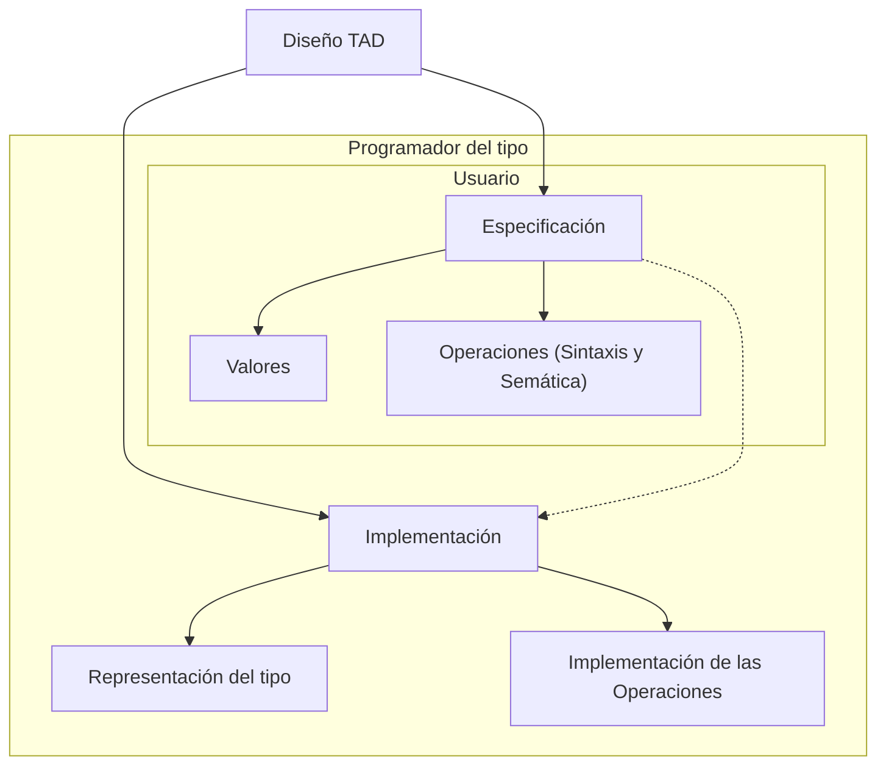

<!--
SPDX-FileCopyrightText: 2024 Pablo Portas López

SPDX-License-Identifier: CC-BY-NC-4.0
-->

<tip>Copyright © 2024 Pablo Portas López</tip>

# Tema 1 - Tipos Abstractos de Datos (TAD)

<tldr>La abstracción funcional y de datos. Especificación, construcción y ejemplos.</tldr>

<note>

Los estudiantes deben convercerse de que la programación no un arte misterioso, sino una disciplina ingenieril...

... la abstracción y la especificación deben ser piezas clave para conseguir una programación efectiva.

- Barbara Liskov 
    
    Profesora en el Massachusetts Institute of Technology (MIT)
    
    Medalla John von Neumann, 2004

    Premio Turing, 2008
    
    Computer Pioneer Award de la IEEE Computer Society, 2018

- John Guttag

  Profesor en el Massachusetts Institute of Technology (MIT)
  
</note>

## ¿Qué es la abstracción?

<procedure>
<title>Abstraer</title>
<step>tr. Separar por medio de una operación intelectual un rasgo o una cualidad de algo para analizarlos aisladamente o considerarlos en su pura esencia o noción.</step>
<step>intr. Hacer caso omiso de algo, o dejarlo a un lado.</step>
</procedure>

<tip>Si la definición de la RAE te ha dejado igual que como estabas. No te preocupes.</tip>

La abstracción, entendiéndola como su primera acepción **es fundamental** tanto en la programación como en cualquier 
disciplina intelectual. 

_Gracias al pensamiento abstracto el avance tecnológico/científico humano no parece tener 
límite._

Un ejemplo sencillo, un conductor **no necesita** conocer el complicado mecanismo que permite a su coche cambiar las 
marchas (siquiera que son las marchas) del motor. **Lo único que debe entender es una implementación (abstracción)** 
"sencilla" como es el embrague y la palanca de cambios y **como interactuar** con ella.

En el ámbito de la programación la abstracción es **constante**. Cuando programamos en C, **no necesitamos** conocer 
como ha sido **implementada** la función ```printf()```, solo debemos conocer **como interactuar** con ella, el formato 
que acepta que puede o no leer, etc.

<note>

Sí te pica la curiosidad, la función ```printf()``` tiene más de **700 líneas de código**, si quieres curiosear una de 
sus implementaciones. [Enlace a "printf.c" de coreutils](https://github.com/coreutils/coreutils/blob/master/src/printf.c)

</note>

En este tema nos centraremos en los **TAD**s los **Tipos Abstractos de Datos**, un tipo de abstracción común y que en el 
futuro nos resultará muy util.

## Definición de Tipo Abstracto de Datos

<note>

Un tipo abstracto de datos es aquel **definido por el programador** que puede ser manipulado de forma **similar** a los 
**definidos por el sistema**.

Al igual que estos últimos, un tipo abstracto de datos corresponde a un **conjunto de valores** lícitos y de 
**operaciones** asociadas a los mismos, operaciones que se definen mediante una **especificación** que es **independiente de 
la implementación** de esos datos.

**John Guttag (1974)**

</note>

A la hora de definir un TAD, debemos seguir unas pautas formales, para obtener la abstracción que **facilita el 
desarrollo** a otros/as programadores/as como nosotros/as.



