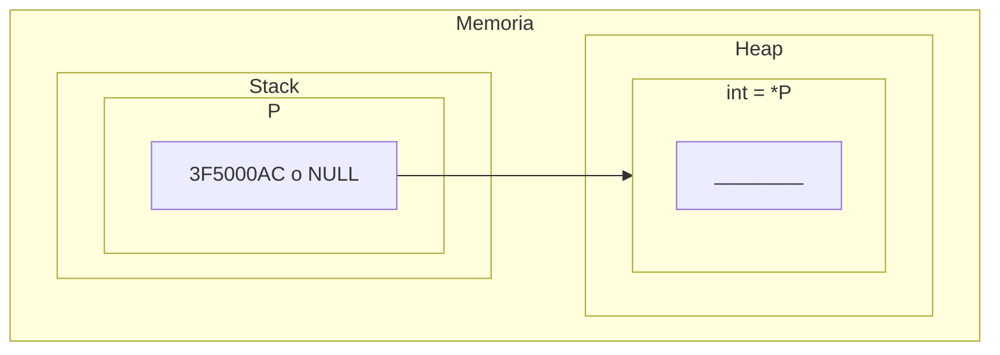
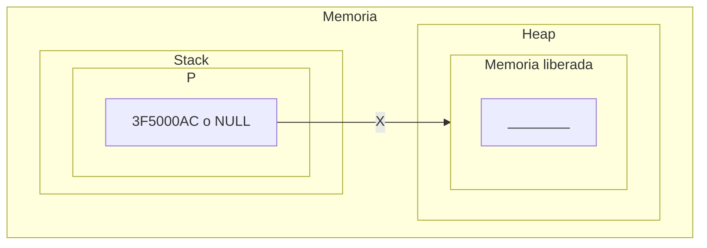
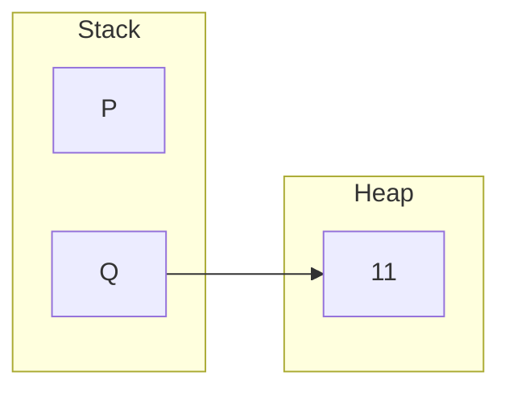
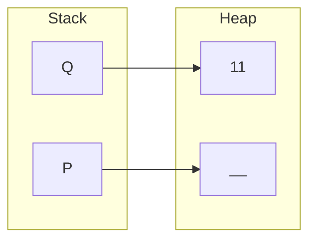
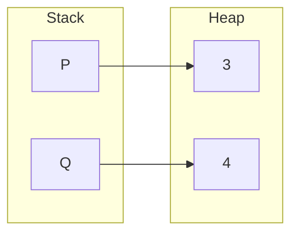
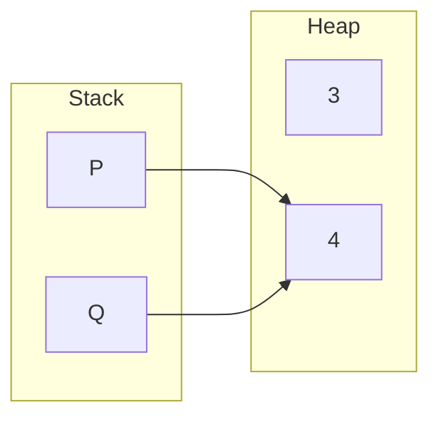
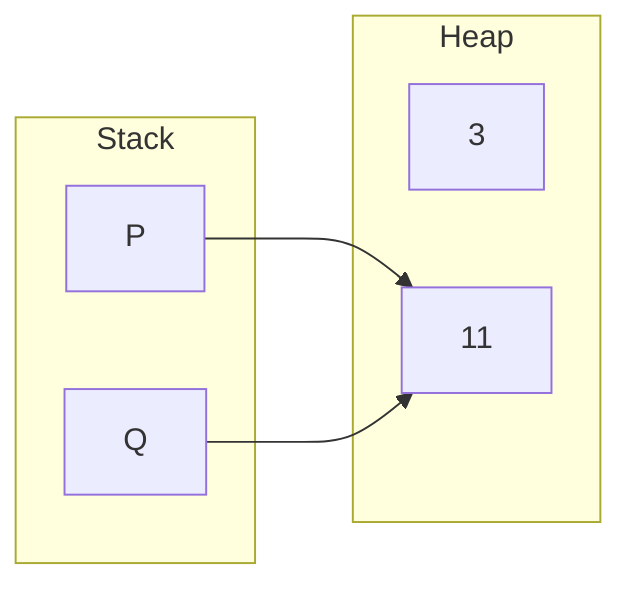
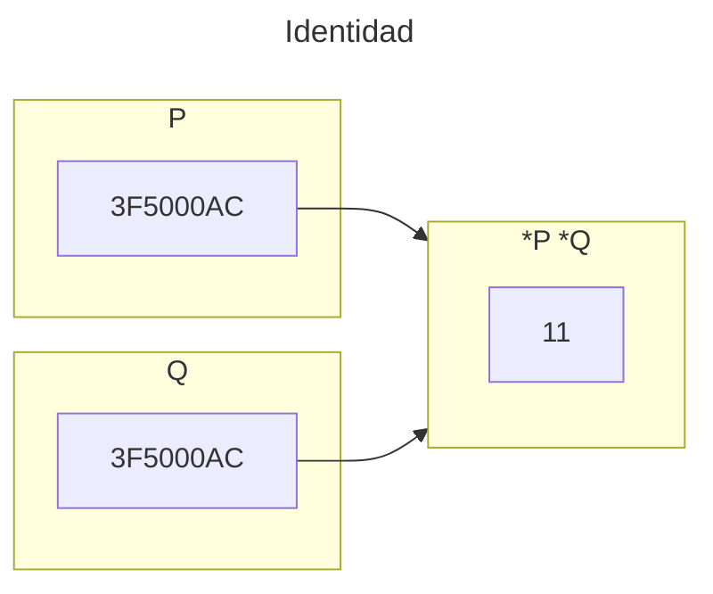
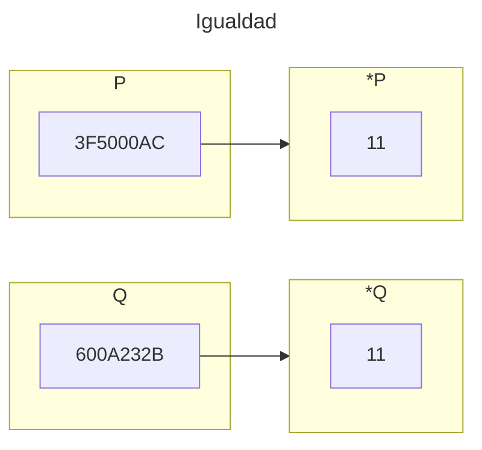

<!--
SPDX-FileCopyrightText: 2024 Pablo Portas López

SPDX-License-Identifier: CC-BY-NC-4.0
-->

<tip>Copyright © 2024 Pablo Portas López</tip>

# Tema 2 - Gestión dinámica de memoria

<tldr>Punteros en profundidad, las variables dinámicas, direcciones de memoria y la gestión de la memoria (pila (stack) y montículo (heap)).</tldr>

## Organización de la memoria de un programa

Existen dos lugares en memoria para almacenar elementos: la pila (**stack**) y el montículo (**heap**).

| Nombre           | Función                                                                                                                                                            |
|------------------|--------------------------------------------------------------------------------------------------------------------------------------------------------------------|
| Código           | El código compilado.                                                                                                                                               |
| Datos estáticos  | Datos estáticos compilados.                                                                                                                                        |
| Pila (stack)     | Se utiliza para la llamada de funciones y punteros, ahí se almacenan sus direcciones, parámetros, constantes locales, etc...                                       |
| ...              | Espacio para crecer.                                                                                                                                               |
| Montículo (heap) | Parte de la memoria que no está ligada a lo guardado en la pila, se utiliza para las variables dinámicas, la memoria se reserva cuando se solicita (```malloc```). |


## Definición de variables de tipo puntero

<deflist>
<def title="Punteros en C">

- Un puntero es un **tipo básico** en C (como ```int```, ```bool```, ```float```, ```etc```.) y como tal **ocupa en memoria una cantidad determinada** (generalmente 4 bytes).
- Una variable de tipo puntero **contiene una dirección de memoria** en la cual se almacena **una variable de otro tipo**.
- Las variables de tipo puntero en C se declara para que apunte a un tipo particular de datos (```int```, ```float```, ```etc```.) y no puede apuntar a ningún otro.

</def>
<def title="Sintaxis">
<code-block lang="C">
// Estructura
typedef tipoApuntado* tipoPuntero
// Otro ejemplo
typedef int* tPEntero
// tPEntero es un puntero a int
tPEntero P
// Has declarado un puntero P 
// que no apunta a nada todavía
</code-block>
</def>
</deflist>

## Reserva y destrucción dinámica de memoria

### Inicialización de punteros

```C
typedef int* tPEntero;
tPEntero P1;
int* P2;
```

- ```tPEntero``` las variables declaradas con este nuevo tipo contendrán direcciones de memoria de **variables enteras**.
- ```P1``` se **reserva memoria** en la **pila** para guardar una **dirección de memoria** (4 bytes) que apuntara a un entero del **montículo**.
- No es necesario definir un tipo para declarar un entero (como se ve en ```int* P2```), pero se recomienda hacerlo de esta manera
  para **aumentar la abstracción**.
- La memoria es reservada, pero **no se elimina los contenidos que ya hubiera en esa zona**. Inicialmente, ```P1``` o ```P2``` contendrá un valor _basura_.
  
  Utilizar punteros con contenido _basura_ puede tener **efectos fatales**. Por lo tanto, es mejor inicializarlos a nulo ```P = NULL;``` 

<warning>En el lenguaje C este valor nulo se representa con la constante <b>NULL</b>.</warning>

### La variable dinámica

#### Creación de una variable dinámica

Para crear la variable dinámica apuntada por un puntero se utiliza el operador ```malloc``` definido en el archivo de cabecera ```stdlib```.

```C
#include <stdlib>
P = malloc(sizeof(int));
// Memoria suficiente para un entero
```




<warning>
En caso de no existir memoria suficiente disponible al puntero <code>P</code> se le asigna valor <b>NULL</b>
</warning>

#### Destrucción de una variable dinámica

Para liberar la memoria de la variable dinámica se utiliza ```free``` definido en el archivo de cabecera ```stdlib```.

Se marcará la variable a la que apunta el puntero como liberada, aunque **la información no es destruida**, ya no es accesible.

```C
#include <stdlib>
free(P);
```



#### Acceso a una variable dinámica

```C
// Declaración
int i;
int* p;

// Creación
/* - - - */
p = malloc(sizeof(int))

// Escritura
i = 5;
*p = 5;

// Lectura
j = i;
j = *p; 
```

## Asignación y comparación de punteros

#### Asignación de valores a punteros

```C
// Tenemos dos variables dinámicas P y Q
P = NULL; // Puntero a valor nulo
P = malloc(sizeof(int)); // Se reserva la memoria (se le asigna dirección de memoria)
*P = 3; // Se le asigna un entero
// Q tenía un valor previo *Q = 4;
P = Q; // Asignamos al puntero el valor de otro puntero
*P = 11;
printf("%d",*Q); // Resultado: 11
```

Es decir ahora ```P``` **no** tiene la dirección de memoria que se le asignó al liberar la memoria, **tiene la de ```Q```**. Visualmente:











### Comparación de punteros

```C
// Identidad
printf(P == Q); // Solo si tienen la misma dirección de memoria
// Igualdad
printf(*P == *Q); // Solo si su contenido es el mismo
```






## Resumen sobre el uso de punteros y variables dinámicas

<deflist>
<def title="Definición y declaración">
  <code-block lang="C">
  typedef int* pEntero;
  pEntero p;
  </code-block>
</def>
<def title="Inicialización / Creación">
  <code-block lang="C">
  p = NULL;
  // O para las Variables dinámica
  p = malloc(sizeof(int));
  </code-block>
  <p>Se recomienda inicializar siempre los punteros, para no dejar valores <i>basura</i>.</p>
</def>
<def title="Destrucción de una variable">
  <code-block lang="C">
  free(p);
  p = NULL;
  </code-block>
  <p>Siempre se debe hacer para crear un programa más eficiente en memoria.</p>
</def>
<def title="Contenido de la variable dinámica">
  <code-block lang="C">
  *p = valor; // Cambiar el valor
  variable = *p; // Copiar el valor
  </code-block>
</def>
<def title="Asignación de valores a punteros">
  <code-block lang="C">
  p = NULL; // Dirección nula
  p = malloc(sizeof()); // Dirección de memoria recién liberada
  p = q; // Dirección de otro puntero
  </code-block>
</def>
<def title="Comparación de punteros">
  <code-block lang="C">
  p == q; p != q; // Comparación entre punteros
  p == NULL; p != NULL; // Comparación con valor nulo
  </code-block>
</def>
</deflist>